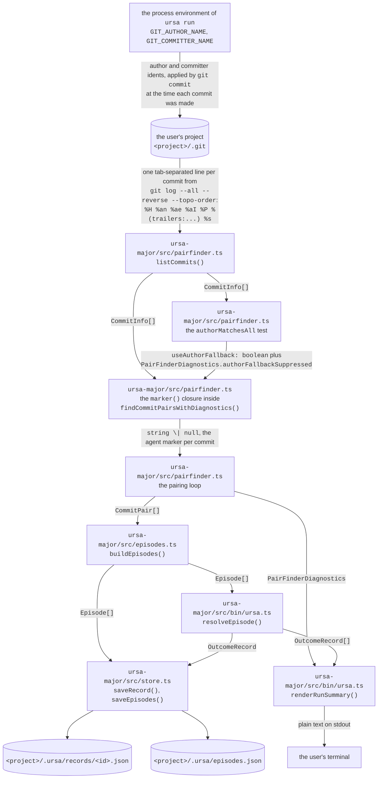

# Agent identity and pair classification

Status: built, 2026-09-30, engineer seat window dispatch. Fixes a break on
`main` at `8c453f0`. Held to the engineering-artifact standard in
`prompts/engineer-agent.md`, all six elements below.

## The question this answers

`ursa run` has to decide, for each commit in a project's history, whether a
model wrote it or the person did. Everything downstream depends on that one
bit. A generated commit paired with the person's edit of it is an episode; an
episode resolved against the final text is an outcome record; the record's span
classes are the product. Get the bit wrong on the person's side and there is no
pair at all, so the generated side's signal is lost too.

Before this change the decision read two things: the commit's
`Co-Authored-By` trailer, and, as a fallback, the commit's author name. The
fallback was applied unconditionally. That is the defect.

## 0. Terms, defined before use

No term below is left as a bare noun (element 6 of the standard).

| Term | What it means here |
|---|---|
| **ambient git identity** | the values of the `GIT_AUTHOR_NAME`, `GIT_AUTHOR_EMAIL`, `GIT_COMMITTER_NAME` and `GIT_COMMITTER_EMAIL` environment variables in the process that runs `git commit`. Git prefers these over the repository's own `user.name` and `user.email`, so whatever exported them decides who authored the commit. |
| **agent marker** | the string that classified a commit as generated. Either the commit's `Co-Authored-By` trailer text, or its author name. Stored on every pair as `CommitPair.agentMarker` and copied into the record as the generation's `model` field. |
| **trailer** | a `Co-Authored-By: Name <email>` line in the commit message body, read with `git log --pretty=%(trailers:key=Co-Authored-By,valueonly)`. Written by the agent that made the commit, so it describes the commit. |
| **author-name fallback** | matching `CommitInfo.authorName` against `DEFAULT_AUTHOR` (`/claude\|codex\|cursor\|gpt\|copilot\|github-actions\|\[bot\]/i`) to classify a commit as generated when it carries no matching trailer. |
| **discriminate** | a test discriminates over a history when it is true of some commits in that history and false of others. A test true of every commit partitions nothing, so it carries no information about which commits were generated. |
| **suppression** | dropping the author-name fallback for one walk, because it did not discriminate. Reported, never silent. |
| **pair** | a `CommitPair`: one generated commit plus the next commit by author date that touches an overlapping path, is not a merge, and carries no agent marker. |
| **episode** | one unit of work built from one pair by `buildEpisodes`, with explicit boundaries. Never inferred from idle time. |
| **final side** | the second commit of a pair, the person's edit. This is the side the defect destroyed. |

## 1. System diagram

Every node is a real file, process or store in this repository, named as it is
named in code. Every edge carries a type name or a file format, never a verb.
Renderable as drawn.



The edge that carries the defect is the first one. It is the only edge into the
system that the user never sees and never chose, and it decides the value of
`CommitInfo.authorName` on every commit the walk reads.

## 2. Interfaces at every component boundary

Real signatures, as a caller would write them.

```ts
// ursa-major/src/pairfinder.ts

export interface PairFinderOptions {
  agentTrailerPattern?: RegExp
  agentAuthorPattern?: RegExp
}

/** What a pair-finding walk decided, so a caller can explain an empty result. */
export interface PairFinderDiagnostics {
  /** commits reachable from any ref, the population the walk classified */
  commitsScanned: number
  /** commits classified generated by their Co-Authored-By trailer */
  generatedByTrailer: number
  /** commits classified generated by author name, after any suppression */
  generatedByAuthorName: number
  /**
   * Set when the author-name pattern matched every commit in the history and
   * was therefore ignored. `authors` lists the distinct author names that
   * matched, which is what a caller should show the user.
   */
  authorFallbackSuppressed: { pattern: string; authors: string[] } | null
}

export function findCommitPairsWithDiagnostics(
  repoPath: string,
  opts?: PairFinderOptions,
): { pairs: CommitPair[]; diagnostics: PairFinderDiagnostics }

/** The pairs alone. Unchanged signature, so no existing caller breaks. */
export function findCommitPairs(repoPath: string, opts?: PairFinderOptions): CommitPair[]
```

```ts
// ursa-major/src/bin/ursa.ts

export function renderRunSummary(
  records: OutcomeRecord[],
  episodes: Episode[],
  diagnostics?: PairFinderDiagnostics,
): string
```

The third parameter is optional on purpose. `renderRunSummary` is called by
`m0.test.ts` with two arguments in places, and a required parameter would have
been a breaking change to a function three open pull requests also call.

The decision rule itself, stated as the code states it:

```ts
// Two commits is the floor: below it no pair can exist, so suppressing would
// change no result and the notice would only mislead.
const authorMatchesAll =
  commits.length >= 2 && commits.every((c) => authorPattern.test(c.authorName))
const useAuthorFallback = !authorMatchesAll
```

## 3. On-disk layout

Nothing about this change adds or moves a file. It changes what ends up in the
files that already exist, because a run that found nothing now finds pairs.

```
<project>/.ursa/
├── episodes.json                     JSON array of Episode
└── records/
    └── <taskId>.json                 one OutcomeRecord
```

`<project>` is the path the user passed to `ursa run`, for example
`~/Desktop/ursa-minor-site`. It is never this repository.

Real payload, from the reproduction described in element 4, at
`/tmp/demo/.ursa/records/demo-2026-09-30-11d20dc.json`. This exact file did not
exist before the fix, because the run that writes it found zero pairs on
`main`. Abridged at the `generations[0].text` and `spans` keys only, marked
where:

```json
{
  "schemaVersion": 1,
  "task": { "id": "demo-2026-09-30-11d20dc", "finished": true },
  "files": [{ "path": "d.js", "text": "export function digest() {\n  return \"The frontier, read for you.\"\n}\n" }],
  "conversations": [
    {
      "id": "git-11d20dc",
      "title": "Generate digest",
      "adapter": "git",
      "model": "Claude <noreply@anthropic.com>",
      "date": "2026-09-30T04:00:05+00:00",
      "turns": 1,
      "userTurns": 0
    }
  ],
  "generations": [
    {
      "conversationId": "git-11d20dc",
      "model": "Claude <noreply@anthropic.com>",
      "turnIndex": 1,
      "kind": "write",
      "filePath": "d.js",
      "timestamp": "2026-09-30T04:00:05+00:00",
      "text": "... the generated blob at the first commit, 84 chars ...",
      "generationIndex": 0,
      "spans": ["... span records, elided ..."],
      "totalChars": 84,
      "survivedChars": 27,
      "survivalRate": 0.321
    }
  ],
  "stats": {
    "finalChars": 68,
    "coveredChars": 63,
    "byClass": {
      "survived_verbatim": { "spans": 2, "chars": 27, "pct": 0.429 },
      "survived_mutated": { "spans": 0, "chars": 0, "pct": 0 },
      "no_generation_provenance": { "spans": 1, "chars": 36, "pct": 0.571 }
    },
    "uncertainSpans": 1,
    "trivialSpans": 1,
    "byModel": { "Claude <noreply@anthropic.com>": { "chars": 27, "pctOfCovered": 0.429 } },
    "generated": { "totalChars": 84, "survivedChars": 27, "deletedChars": 57, "deletedPct": 0.679 }
  }
}
```

Read `model` twice. It is the agent marker, so it is the trailer text
`Claude <noreply@anthropic.com>` and not the author name `Claude`. That is the
point: the trailer is what survived the suppression, and the record names the
evidence it was classified by.

**What the record does not yet carry**, stated because leaving it implicit
would be the vagueness the standard forbids: `PairFinderDiagnostics` is printed
to the terminal and then discarded. A record produced under a suppressed
fallback is indistinguishable on disk from one produced without. A lab
consuming the record cannot tell how the generated side was identified. Filed
as a ledger idea rather than built here, because it changes `OutcomeRecord` and
sprint item 2 (#16) owns that schema this week.

## 4. Exact commands

The reproduction on `main`, which is where the break was found. Run from a
clone at `8c453f0`:

```bash
cd ursa-major && npm ci
GIT_AUTHOR_NAME=ursa-engineer GIT_COMMITTER_NAME=ursa-engineer npm test
#  Test Files  1 failed | 4 passed (5)
#       Tests  1 failed | 35 passed (36)
#  AssertionError: expected 'ursa-engineer' to be 'Human Owner'
```

The product-level reproduction. Four identical histories, one per ambient
identity, each two commits where the first carries a `Co-Authored-By: Claude`
trailer and the second does not:

```bash
npx tsx /tmp/probe.mts
# on main (8c453f0):
#   A. env vars unset                 {"pairs":1,"finalAuthor":"Human Owner"}
#   B. GIT_AUTHOR_NAME=ursa-engineer  {"pairs":1,"finalAuthor":"ursa-engineer"}
#   C. GIT_AUTHOR_NAME=Claude         {"pairs":0,"finalAuthor":null}
#   D. GIT_AUTHOR_NAME=Cursor         {"pairs":0,"finalAuthor":null}
# on this branch: A, B, C and D all report {"pairs":1}
```

The end-to-end case, a project a user would really have, built and run
literally:

```bash
mkdir -p /tmp/demo && cd /tmp/demo
export GIT_AUTHOR_NAME=Claude GIT_COMMITTER_NAME=Claude \
       GIT_AUTHOR_EMAIL=c@example.com GIT_COMMITTER_EMAIL=c@example.com
git init -q -b main
printf 'export function digest() {\n  return "DIGEST, the latest research, summarized for you."\n}\n' > d.js
git add -A && git commit -q -m 'Generate digest

Co-Authored-By: Claude <noreply@anthropic.com>'
printf 'export function digest() {\n  return "The frontier, read for you."\n}\n' > d.js
git add -A && git commit -q -m 'Tighten prose'

cd /path/to/Ursa/ursa-major
npx tsx src/bin/ursa.ts run /tmp/demo --min-chars 10
```

On `main` that prints `0 work units found, 0 resolved into records.` and
nothing else. On this branch it prints:

```
1 work units found, 1 resolved into records.
27 chars survived your editing verbatim, 0 survived edited.
That's the part worth noticing: not what got written, what got kept.
84 chars were generated to get there; 68% were drafts you discarded on the way.

Every commit in this history is authored "Claude".
That name matches the agent-identity pattern, so on its own it cannot tell a generated commit from one of yours, and it was set aside for this run. Only the Co-Authored-By trailer classified commits.
If your own commits really do carry that name, set a different one for them, or pass a narrower author pattern, and run again.

Records: /tmp/demo/.ursa/records/
```

The regression suite, which is the acceptance gate:

```bash
cd ursa-major && npm test
#  Test Files  5 passed (5)
#       Tests  43 passed (43)
```

The precedence fact the whole defect rests on, checkable in four lines:

```bash
mkdir -p /tmp/prec && cd /tmp/prec && git init -q -b main
git config user.name 'Human Owner' && git config user.email h@example.com
GIT_AUTHOR_NAME=Claude GIT_AUTHOR_EMAIL=c@e.com \
GIT_COMMITTER_NAME=Claude GIT_COMMITTER_EMAIL=c@e.com \
  git commit -q --allow-empty -m x
git log --pretty=%an          # Claude, not Human Owner
```

## 5. Tooling

Every tool with its version, its job here, and why it rather than the
alternative that was considered.

| Tool | Version | Its job in this change | Why this and not the alternative |
|---|---|---|---|
| `git` | 2.43.0 (the runner's) | the history the walk reads, and the thing whose ident-precedence rule caused the defect | not a choice. The relevant behaviour, environment ident beating `user.name`, is git's and has been stable for its whole life, so the fix must accommodate it rather than assume it away. |
| Node.js | 22.23.2 | runs the walk and the suite | already the package's floor via `@types/node ^22.10.0`. Nothing here needs a newer runtime, so the floor is not raised. |
| `vitest` | 2.1.9, from `^2.1.8` in `ursa-major/package.json` | the 43-test suite, including the 7 new cases | left exactly as `main` has it. PR #36 raises this floor to `^5.0.2` as a security fix, and this branch deliberately touches no dependency so that it cannot fight #36 in either merge order. |
| `tsx` | 4.19.2 | runs `src/bin/ursa.ts` and the throwaway probe without a build step | chosen over compiling with `tsc` first because the probe had to run against `main`'s source and this branch's source in the same session, and a build step would have doubled the setup for a file that exists to be thrown away. |
| `execFileSync` from `node:child_process` | bundled with Node 22.23.2 | every `git` invocation, in both the product and the fixtures | chosen over `execSync` because it takes an argument array, so a commit message containing a newline and angle brackets (`Co-Authored-By: Claude <noreply@anthropic.com>`) needs no shell quoting and cannot be reinterpreted by a shell. The fixtures depend on that message arriving byte-exact, since the trailer is what classifies the commit. |
| the `env` option of `execFileSync` | same | states the fixtures' identities instead of inheriting them | chosen over `git commit --author=` because `--author` sets only the author, leaving the committer to the environment, and over `git -c user.name=` because a `-c` config value still loses to the environment variable. The environment is the only layer that wins against the environment. |

## 6. Rollback

One revert, no data migration, nothing to undo on disk:

```bash
git revert --no-commit <this branch's fix commit>
```

`findCommitPairs` kept its old signature, `PairFinderDiagnostics` is additive,
and the record format is byte-identical to before. Reverting restores the old
classification rule, which means restoring the zero-pair behaviour under a
harness identity and the red test. Records already written stay valid and
readable either way.
