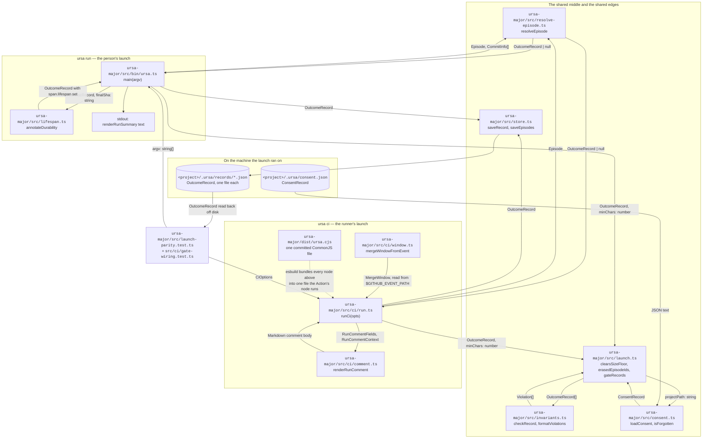

# Launch parity: two launches, one resolver

**Status.** Built 2026-10-10 (`engineer/2026-10-10-two-launches-one-resolver`).
Closes the ledger entry "Two launches share one resolver and nothing
checks they agree" (2026-10-08, `docs/ideas.md`).

**The claim this document is about.** Ursa Major has two launches. One is
`ursa run`, typed by a person against a project they have finished
(`ursa-major/src/bin/ursa.ts`). The other is `ursa ci`, fired by a merged
pull request on a GitHub Actions runner
(`ursa-major/src/ci/run.ts`). Both are sold as the same resolve step fired
two ways, and that claim is the whole premise of the Action surface: a lab
auditing an outcome record made in CI is auditing the local resolver's
behaviour, or it is auditing nothing.

**What the claim rested on before today.** One import path. On 2026-10-08,
reconciling PR #92 onto `main`, the tree briefly held two live definitions
of `resolveEpisode` — same name, same signature, different behaviour —
with `src/ci/run.ts` importing the one that was four features older. The
full suite passed on that merge. Nothing failed, because no test resolved
one repository through both launches and compared the records.

**What this document specifies.** The differential test that turns the
claim into a check, the three divergences it found the first time it ran,
and the one module that now holds the decisions both launches must make
identically.

Terms used below, each defined once here because the rest of the document
leans on them:

- **Work unit / episode** — one generated-then-edited commit pair, as
  produced by `src/pairfinder.ts` and bounded by `src/episodes.ts`. The
  unit a record is written about.
- **Outcome record** — the JSON artifact in
  `<project>/.ursa/records/<id>.json`: a finished piece of work joined
  backward to the generations that fed it, with every span of the finished
  text classified by what happened to it.
- **Refusal-only record** — an outcome record with no files and no
  generations, carrying one `exclusions` entry. Written when every
  resolvable path in an episode was an import (`src/vendored.ts`), so that
  the absence states itself instead of being an absent file on disk. See
  `docs/design/record-exclusions.md`.
- **The fifteen bounds** — the self-consistency checks in
  `src/invariants.ts` that a record must satisfy, ten of them arithmetic.
- **Erasure** — the user's deletion of a record and everything derived
  from it, recorded as a tombstone by `ursa forget` in
  `<project>/.ursa/consent.json`. See `docs/design/consent-and-erasure.md`.

---

## 1. System diagram

Every node is a file that exists in this repository at the path given.
Every edge carries the TypeScript type or the file format that crosses it.



**The edge worth reading twice** is the dotted one. `dist/ursa.cjs` is a
committed artifact, so a change to any `src/` node above is live in
`ursa run` the moment it is merged and live in `ursa ci` only after
`npm run bundle` regenerates that file. The freshness check is
`npm run bundle:check` (exact invocation in §4).

**What the test node does, in one sentence per edge.**
`src/launch-parity.test.ts` builds a git fixture repository, calls
`runCi` against it, reads the records off
`<fixture>/.ursa/records/`, deletes `<fixture>/.ursa/`, calls
`main(['run', <fixture>, ...])` against the same clone, reads those
records off the same path, and asserts the two sets are equal on every
field except the ones §3.3 names.

---

## 2. Interfaces at every component boundary

The three signatures `src/launch.ts` adds, as a caller writes them:

```ts
// ursa-major/src/launch.ts

/**
 * Is this resolved record big enough to be worth writing? Asked of the
 * generation side when there is one, and answered `true` for a
 * refusal-only record, which has none.
 */
export function clearsSizeFloor(record: OutcomeRecord, minChars: number): boolean

/**
 * Which of these episode ids the user has erased. A set rather than a
 * predicate so a caller reads `<project>/.ursa/consent.json` once per run
 * instead of once per episode.
 */
export function erasedEpisodeIds(projectPath: string, episodeIds: string[]): Set<string>

export interface GateResult {
  violations: Violation[]
  /** empty string when the gate passed, so a caller can print it unconditionally */
  report: string
}

/** All fifteen bounds, run over everything a launch just wrote. */
export function gateRecords(records: OutcomeRecord[]): GateResult
```

The two launch entry points, unchanged in shape and changed in what they
return:

```ts
// ursa-major/src/bin/ursa.ts
export async function main(argv: string[]): Promise<number>
// 0 when every record satisfies all fifteen bounds, 1 when one does not,
// 2 on a usage error. Unchanged by this work.

// ursa-major/src/ci/run.ts
export async function runCi(opts: CiOptions): Promise<CiResult>
```

`CiResult` gains one field, which is what makes its `exitCode` non-zero:

```ts
export interface CiResult {
  exitCode: number
  window: MergeWindow | null
  fields: RunCommentFields | null
  comment: string | null
  commentUrl: string | null
  priorAcceptance: PriorAcceptance | null
  declaration: Declaration
  mode: DistillMode
  recordPaths: string[]
  /** every bound the records this run wrote violated; empty on a healthy run */
  invariantViolations: Violation[]
}
```

`RunCommentContext` gains one optional field, read only by the detail
block:

```ts
// ursa-major/src/ci/comment.ts
export interface RunCommentContext {
  prNumber: number
  repo: string
  range: string
  windowNote: string
  declarationBasis: string
  recordsPath: string
  runUrl: string | null
  dropped?: { unresolvable: number; belowMinChars: number; minChars: number }
  /** how many of the fifteen bounds the records violated; absent reads as 0 */
  invariantViolations?: number
}
```

The test's own boundary, the projection both records are reduced to before
comparison:

```ts
// ursa-major/src/launch-parity.test.ts
function comparable(record: OutcomeRecord): Record<string, unknown>
function topLevelDiff(a: OutcomeRecord, b: OutcomeRecord): string[]
const ALLOWED_TO_DIFFER = ['signals', 'durability', 'lifespan'] as const
```

---

## 3. On-disk layouts

### 3.1 What a launch writes, and where

```
<project>/.ursa/
├── records/
│   └── <episodeId>.json          one OutcomeRecord per work unit
├── episodes.json                  the episode index
├── consent.json                   ConsentRecord: scopes and erasure tombstones
├── tuning.json                    TuningRecord, written by the distiller
└── acceptance.jsonl               one JSON object per 👍 read, ursa ci only
```

`<project>` is the user's own project, not this repository:
`~/Desktop/ursa-minor-site` on a laptop, `$GITHUB_WORKSPACE` on a runner.
`.ursa/` belongs in that project's `.gitignore`; raw records never leave
the machine they were made on.

### 3.2 A real example payload: the record that `ursa ci` used to drop

Produced by the exact commands in §4.2 against a throwaway three-commit
repository, with the two machine-specific strings written in placeholder
form per the redaction rider in `prompts/engineer-agent.md` (the commit
shas are real and short; the path is a placeholder that is still runnable).

`<project>/.ursa/records/repo-2026-10-10-3604592.json`, abridged to the
keys this document is about:

```json
{
  "task": { "id": "repo-2026-10-10-3604592" },
  "artifact": { "kind": "repo" },
  "files": [],
  "generations": [],
  "exclusions": [
    {
      "path": "vendor.md",
      "reason": "imported_whole",
      "sha": "98c90da",
      "subject": "Base: carry the upstream document",
      "relation": "pre_existing",
      "chars": 138
    }
  ],
  "stats": {
    "finalChars": 0,
    "generated": { "totalChars": 0, "charsWritten": 0, "separatorChars": 0 },
    "byClass": {
      "survived_verbatim": { "spans": 0, "chars": 0, "pct": 0 },
      "survived_mutated": { "spans": 0, "chars": 0, "pct": 0 },
      "generated_deleted": { "spans": 0, "chars": 0, "pct": 0 },
      "no_generation_provenance": { "spans": 0, "chars": 0, "pct": 0 }
    }
  }
}
```

Every number in it is zero, and that is the point: the record exists to
say that one path was read, found to be an import of commit `98c90da`, and
excluded. Before this work, `ursa ci` dropped this record under
`--min-chars` and its run comment said, in the repository where it was
measured:

> Nothing resolved in this window. That is a reading, not a failure: 1
> work unit was found, and it did not become a record. The reason: 1
> carried fewer than 200 generated characters, the `--min-chars` floor.

That sentence sends the reader to raise a flag. The actual fact is that
the only file in the window arrived from elsewhere, which no flag changes.

### 3.3 The allowlist, field by field, with the reason each is allowed

| Field in `OutcomeRecord` | What it holds | Why the two launches may differ on it |
|---|---|---|
| `signals` | the derived correction signals plus the acceptance declaration carried into the record | `ursa ci` appends the note `CI launch: <window note>` and carries a declaration read off a 👍 reaction; `ursa run` carries whatever `--declare` said. Different by construction, not by drift. |
| `durability` | the record-level summary of how long surviving text lasted: `decayRate` and the span counts behind it | Produced by `src/lifespan.ts`, which walks the commits that came after the episode closed. At merge time there are none yet, so the CI record claims nothing rather than claiming `untested` everywhere. |
| `lifespan` (on each span in `files[].spans`) | that one span's fate: `durable`, `eroded`, `decayed` or `untested` | Same reason as `durability`. Reported separately because the two drift independently: a record can carry per-span fates and a stale summary. |

Everything else is compared, and `comparable()` in
`src/launch-parity.test.ts` is the list: `task.id`, `artifact`,
`stats.byClass`, `stats.generated`, `stats.finalChars`, `stats.perFile`,
`exclusions`, the `files[].path` list, each file's `mode`, every final
span's `class`, extent, `score`, `uncertain`, `trivial`, `descent.basis`,
word-level `diff` shape and `source` pointer, and every generation's
`filePath`, `kind`, `charsWritten`, `totalChars`, `separatorChars` and
per-span `fate` with its deletion cause.

**Why the allowlist is written out rather than derived from a failing
run.** Deep equality, loosened whenever it fails, converts every future
divergence into a one-line test edit. That is precisely the shape of the
divergence this document exists for: the 2026-10-08 merge was a line git
accepted without conflict.

**Why the span projection goes deeper than class and extent.** The ledger
entry's first step asked for `stats.byClass` and per-span
classifications. Measured on 2026-10-10 by pointing `src/ci/run.ts` at a
copy of the resolve step with `gitDescentCorroborator` removed — the exact
2026-10-08 scenario — a class-and-extent projection **passed**. Every
class and every extent matched; what differed was `descent` and the
word-level `diff` beside it, which is the evidence a reader uses to decide
whether a `survived_mutated` label means an edit happened at all. So the
projection carries those too.

---

## 4. Exact commands

### 4.1 The checks this work runs

```bash
# every command below from ursa-major/
cd ursa-major

npm ci                      # install against package-lock.json
npm test                    # tsc --noEmit && vitest run  → 505 passed, 4 skipped
npx vitest run src/launch-parity.test.ts     # the 8 parity tests alone
npx vitest run src/ci/gate-wiring.test.ts    # the 2 gate-wiring tests alone
npm run bundle              # regenerate dist/ursa.cjs after any src/ change
npm run bundle:check        # fail if the committed bundle is stale
```

From the repository root:

```bash
node scripts/dep-floor.mjs  # no critical anywhere, no high in a production tree
```

### 4.2 Reproducing §3.2's payload from scratch

```bash
mkdir -p /tmp/smoke/repo && cd /tmp/smoke/repo
export GIT_AUTHOR_NAME="Human Owner" GIT_AUTHOR_EMAIL=human@example.com
export GIT_COMMITTER_NAME="Human Owner" GIT_COMMITTER_EMAIL=human@example.com
git init -q -b main

printf '# Vendored standard\n\nThis document is carried, not written. It arrived whole from upstream\nand every line of it predates this repository.\n' > vendor.md
git add . && git commit -q -m "Base: carry the upstream document"

printf '# Vendored standard\n\nThis document is rewritten by an agent. It arrived whole from upstream\nand every line of it predates this repository.\n' > vendor.md
git add . && git commit -q -m "Rewrite the vendored document

Co-Authored-By: Claude <noreply@anthropic.com>"

printf '# Vendored standard\n\nThis document is carried, not written. It arrived whole from upstream\nand every line of it predates this repository.\n' > vendor.md
git add . && git commit -q -m "Restore the vendored document"

HEAD_SHA=$(git rev-parse HEAD); BASE_SHA=$(git rev-parse HEAD~2)
cat > /tmp/smoke/event.json <<EOF
{"repository":{"full_name":"o/r"},"pull_request":{"number":1,"merged":true,
"merge_commit_sha":null,"base":{"sha":"$BASE_SHA"},"head":{"sha":"$HEAD_SHA"}}}
EOF

# the Action's own one-file binary, no install, exactly as the runner runs it
node <ursa-checkout>/ursa-major/dist/ursa.cjs ci /tmp/smoke/repo \
  --repo o/r --event /tmp/smoke/event.json --no-post
```

The third commit restores `vendor.md` byte for byte, so the finished blob
is identical to a blob in a commit that is an ancestor of the generation,
which is what `src/vendored.ts` reads as an import with
`relation: "pre_existing"`.

### 4.3 The four negative checks, which are the evidence the tests can fail

Each is a temporary edit, run, and revert. All four were run on
2026-10-10; §5 records what each printed.

```bash
cd ursa-major && cp src/ci/run.ts /tmp/run.ts.bak

# 1. the size floor: restore the generation-side-only question
sed -i 's|if (!clearsSizeFloor(record, minChars)) { dropped.belowMinChars++; continue }|if (record.stats.generated.totalChars < minChars) { dropped.belowMinChars++; continue }|' src/ci/run.ts
npx vitest run src/launch-parity.test.ts; cp /tmp/run.ts.bak src/ci/run.ts

# 2. the self-check: remove the gate call and force exitCode 0
#    (edit src/ci/run.ts by hand: drop `const gate = gateRecords(records)`,
#     the log line, the `invariantViolations` fields, and the ternary)
npx vitest run src/ci/gate-wiring.test.ts; cp /tmp/run.ts.bak src/ci/run.ts

# 3. erasure: remove the tombstone skip
sed -i '/if (erased.has(episode.id)) { suppressed++; continue }/d' src/ci/run.ts
npx vitest run src/launch-parity.test.ts; cp /tmp/run.ts.bak src/ci/run.ts

# 4. a stale resolve step on one launch only — the 2026-10-08 scenario
cp src/resolve-episode.ts src/resolve-episode.stale.ts
sed -i 's|    corroborate: gitDescentCorroborator(projectPath, ep.generatedSha, graph),|    // the stale copy: four features older, no descent corroboration|' src/resolve-episode.stale.ts
sed -i "s|from '../resolve-episode'|from '../resolve-episode.stale'|" src/ci/run.ts
npx vitest run src/launch-parity.test.ts
cp /tmp/run.ts.bak src/ci/run.ts && rm src/resolve-episode.stale.ts
```

---

## 5. What the four negative checks printed

| Check | Which test failed | The assertion, as the runner printed it |
|---|---|---|
| 1. size floor reverted on the CI path | `the refusal-only record survives both launches > keeps the exclusion-only record on both paths at the default floor` | `AssertionError: expected [] to deeply equal [ Array(1) ]`, the received side empty against an expected side holding the episode id — the CI launch wrote no record at all for the imported-whole episode |
| 2. self-check removed from the CI path | both tests in `src/ci/gate-wiring.test.ts` | `expected +0 to be 1` — `runCi` reported success over a record that violated a bound |
| 3. erasure skip removed from the CI path | `an erased episode stays erased on both launches > resolves nothing in CI for an episode the user forgot` | `expected [ Array(1) ] to deeply equal []` — the CI launch rebuilt a record the user had deleted |
| 4. CI pointed at a stale copy of the resolve step | `agrees on every span class, every span extent, and every stats block` and `differs only on the fields the allowlist names` | `expected [ 'files' ] to deeply equal []` — the two launches disagreed on `descent` and the word-level `diff`, with every class and extent identical |

Check 2 is the one that changed this work's shape. The first version of
the parity test asserted only that a healthy repository passes the gate on
both launches, and that assertion passes identically whether the gate runs
or does not exist: removing the call left all eight parity tests green.
A test that cannot fail is not evidence, which is why
`src/ci/gate-wiring.test.ts` exists as a separate file. It replaces
`checkRecord` with one that reports a violation, because no git fixture
reliably produces an arithmetically impossible record — the resolver is
correct, which is the whole reason the bounds exist.

---

## 5b. One number this work had to get right first

The run comment's new self-check line reports how many bounds the records
passed, which makes the count a figure shown to a buyer rather than a
figure in a comment. Writing it surfaced that the count in the repository
was wrong.

`README.md` and three design documents said **thirteen**. The union
`InvariantCode` in `ursa-major/src/invariants.ts` has **fifteen** members
and `BOUNDS` has fifteen keys, verified by counting both and comparing the
sets:

```bash
cd ursa-major && node -e "
const src=require('fs').readFileSync('src/invariants.ts','utf8');
const t=src.match(/export type InvariantCode =([\s\S]*?)\n\nexport interface Violation/)[1];
const codes=[...t.matchAll(/\|\s*'([A-Z_]+)'/g)].map(m=>m[1]);
const b=src.match(/const BOUNDS: Record<InvariantCode, string> = \{([\s\S]*?)\n\}/)[1];
const keys=[...b.matchAll(/^  ([A-Z_]+):/gm)].map(m=>m[1]);
console.log(codes.length, keys.length,
  JSON.stringify(codes.sort())===JSON.stringify(keys.sort()));
"
# → 15 15 true
```

The drift has a date. `docs/design/record-exclusions.md` §4.1 calls
`EXCLUSION_NOT_CLASSIFIED` "the thirteenth bound," which it was on the day
that document was written. `DESCENT_CHECKED_UNIFORMLY` and
`SIGNAL_QUOTE_GROUNDED` landed around it, and the word in prose never
moved. The README's breakdown was wrong in the same place: it said "ten of
them arithmetic" where twelve are arithmetic or structural.

So the number is no longer written as a word anywhere it is shown:

```ts
// ursa-major/src/invariants.ts
export const BOUND_COUNT = Object.keys(BOUNDS).length
```

`src/ci/comment.ts` interpolates `BOUND_COUNT`, and both tests that assert
on that sentence assert against `BOUND_COUNT` rather than against a
literal, so neither can pin a stale count. Verified through the committed
bundle, which is what the Action actually runs:

```
- Self-check: every record above satisfies all 15 of the bounds a record
  must satisfy, so the figures in the table are at least internally
  consistent.
```

---

## 6. Tooling

| Tool | Version | Its job here | Why it, over what else was considered |
|---|---|---|---|
| Node.js | 22.23.3 (runtime), engines floor `>=20` | Runs both launches, the test suite, and the bundled Action binary | The Action runs on a GitHub-hosted runner whose own `node` is the only interpreter guaranteed present, so the bundle targets it. A Deno or Bun target would need an install step on the runner, which `docs/design/resolver-action.md` refuses. |
| TypeScript | 5.7.2 | `tsc --noEmit` is the first half of `npm test`; the allowlist and the projection are typed against `OutcomeRecord`, so a renamed field breaks the test at compile time rather than silently comparing two `undefined`s | Checked types are what make a projection over a 40-field record maintainable. Plain JavaScript with JSDoc was not considered: every other module here is TypeScript. |
| Vitest | 5.0.2 | Runs all 509 tests; `vi.mock` with `importOriginal` is what lets `src/ci/gate-wiring.test.ts` replace one export of `src/invariants.ts` and keep the other twelve real | Already the project's runner. `node:test` has no module-mocking facility of this shape, which would have left divergence 2 untestable without a seam in production code. |
| git | 2.55.0 | Builds the fixture repositories commit by commit, which is the only honest fixture for a resolver that reads git history | A hand-written fake commit graph was considered and rejected: `src/vendored.ts` and `src/corroborate.ts` ask real questions of real blob object ids, so a fake would test the fake. |
| esbuild | 0.28.2 (`^0.28.0`) | Bundles every `src/` module into the single committed `ursa-major/dist/ursa.cjs` the Action's node executes with no install | Chosen in `docs/design/resolver-action.md` for one-file CommonJS output and sub-second builds. `tsc` alone emits a module tree, not one file; `webpack` and `rollup` both need more configuration for the same artifact. |
| `diff` | 8.0.2 | Produces the word-level `DiffPart[]` the parity projection compares by shape | Pre-existing dependency of the resolver, not added here. |

---

## 7. What this does not do, named rather than left out

1. **It does not make the CI launch carry the time dimension.** A
   merge-time record claims nothing about how long text lasted, because at
   merge time nothing has come after it. Whether `ursa ci` should walk the
   commits a later merge adds is a product decision about what a
   merge-time record may assert, and it is in the ledger as its own entry
   rather than decided here.
2. **It does not compare a chat-trace record across launches,** because
   `ursa ci` has no chat-trace path. Only the git commit-pair path is
   fired both ways, so only it can be compared.
3. **It does not check the bundle against the sources it was built from
   at pull-request time.** `npm run bundle:check` exists and is run by
   hand. Making it a merge gate is the open ledger entry "Make the
   bundle's freshness a merge gate, not a convention" (2026-10-05), which
   is blocked on the `workflows` permission every seat lacks.
4. **It compares two records, not two run surfaces.** The run comment and
   the local summary are rendered from the same `stats`, so a record-level
   comparison covers the numbers in both; it does not assert the two
   surfaces word the same number the same way, and they should not.
