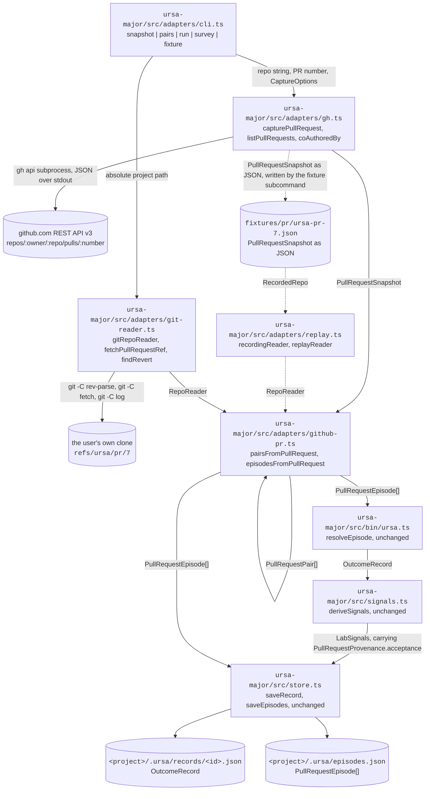

# The PR adapter: reading corrections out of pull requests

Engineer seat, 2026-09-28. Implements `docs/design/product-plan.md` §8
(GitHub spine), read against the engineering-artifact standard in
`prompts/engineer-agent.md`. Every path, command, signature, and number
below is real and was produced on this branch.

## 1. The observation that forced it

`ursa-major/src/pairfinder.ts` is the M0 capture path. It walks a
project's git history, marks a commit as generated when its
`Co-Authored-By` trailer matches the agent pattern, and pairs it with
the next commit by a human that touches an overlapping path. On a
repository a person edits by hand, that works. On a repository run by
agents through pull requests, it finds almost nothing, for a reason that
is not a bug in the pair finder.

Two measurements, both real:

| Repository | Commits read | Work units the git-diff adapter found |
|---|---|---|
| `alexandrapaiz/alexandria`, full history, trial n=2 on 2026-09-20 | 374 | 1 genuine generated-then-edited pair, plus 18 merge artifacts that the merge-skip fix then removed |
| `alexandrapaiz/Ursa`, full history, measured 2026-09-28 by `npx tsx src/bin/ursa.ts run` | 34 | 0 |

Zero, in the repository where seven agent seats have been producing work
every day for ten days and the owner has merged thirteen pull requests.
The corrections are not missing. They are inside the pull requests, in
three places the pair finder cannot reach: a human commit on the branch
before merge, the content a human writes while resolving a merge
conflict, and the merge itself, which is an explicit act of acceptance
rather than mere retention.

This adapter reads those three places. It emits the same `CommitPair`
and `Episode` shapes M0 already produces, so `ursa-major/src/resolve.ts`
is reused with no change and no second record schema exists.

## 2. System diagram

Nodes are files that exist on this branch. Edge labels are the exact
type or file format that crosses them.



Node by node, so this renders without anyone inventing content.

| Node | What it is | What it holds or does |
|---|---|---|
| `github.com REST API v3` | GitHub's own HTTP API, reached only through the `gh` command-line tool | Returns the pull request, its commits, its review comments, and each commit's file list and patch |
| `ursa-major/src/adapters/cli.ts` | the adapter's command line, a TypeScript file run by `tsx` | Parses flags with `node:util` `parseArgs`, and dispatches the five subcommands named in the diagram |
| `ursa-major/src/adapters/gh.ts` | the only file in the adapter that reaches the network | Builds a `PullRequestSnapshot` from four `gh api` calls, and parses `Co-Authored-By` trailers out of commit messages |
| `fixtures/pr/ursa-pr-7.json` | a real captured snapshot of pull request 7 of this repository, 12 kilobytes | The snapshot plus the recorded blob object ids the adapter looked up, so the same pairing replays offline in a test |
| `ursa-major/src/adapters/git-reader.ts` | the local half, over a clone the user already has | Blob object ids at a commit, parent shas of a commit, detection of a later commit that reverts a merge, and the one fetch that makes a pull request's branch commits reachable |
| the user's own clone | the git repository on the user's machine, never Ursa-operated compute | After `fetchPullRequestRef`, the pull request's head is reachable at `refs/ursa/pr/<number>`, which keeps `git branch` output unchanged |
| `ursa-major/src/adapters/github-pr.ts` | the adapter proper, pure, no network and no filesystem access | Decides one closure per agent commit and emits pairs and episodes |
| `ursa-major/src/adapters/replay.ts` | record and replay for the blob reader | Records object ids, never file contents, so a fixture carries no source text |
| `ursa-major/src/bin/ursa.ts` | M0's own entry point, reused as a library and not edited | `resolveEpisode` reads both blobs of a pair and returns an `OutcomeRecord` |
| `ursa-major/src/signals.ts` | signal derivation, reused and not edited | Turns every mutated span into a one-shot correction and carries the acceptance declaration into the record |
| `ursa-major/src/store.ts` | the on-disk writer, reused and not edited | Writes one record per file and one episode index per project |
| `<project>/.ursa/records/<id>.json` | the record store on the user's machine | One `OutcomeRecord` per resolved pair. Never leaves the machine |
| `<project>/.ursa/episodes.json` | the episode index | Every episode, each carrying its `pullRequest` provenance block |

## 3. Interfaces at every boundary

The signatures a caller writes against, copied from the files named
above.

```ts
// src/adapters/gh.ts
export function capturePullRequest(
  repo: string,
  number: number,
  opts?: { noPatches?: boolean; repoPath?: string },
): PullRequestSnapshot
export function listPullRequests(
  repo: string,
  state?: 'all' | 'merged' | 'open',
  limit?: number,
): Array<{ number: number; title: string }>
export function currentRepo(repoPath: string): string
export function coAuthoredBy(message: string): string

// src/adapters/git-reader.ts
export function gitRepoReader(repoPath: string): RepoReader
export function fetchPullRequestRef(repoPath: string, number: number, remote?: string): string
export function findRevert(
  repoPath: string,
  mergeSha: string,
  baseRef: string,
  subject?: string,
): { sha: string; subject: string; at: string } | null

// src/adapters/github-pr.ts
export interface RepoReader {
  blobId(sha: string, path: string): string | null
  parents(sha: string): string[]
}
export function pairsFromPullRequest(
  snap: PullRequestSnapshot,
  reader: RepoReader,
  opts?: { agentTrailerPattern?: RegExp; agentAuthorPattern?: RegExp },
): PullRequestPair[]
export function episodesFromPullRequest(
  pairs: PullRequestPair[],
  projectPath: string,
): PullRequestEpisode[]
export function statedCorrectionsFor(
  snap: PullRequestSnapshot,
  paths: string[],
  afterSha: string,
): StatedCorrection[]
export function parseHunkRanges(patch: string): Array<[number, number]>

// src/adapters/replay.ts
export function recordingReader(inner: RepoReader): { reader: RepoReader; recorded: RecordedRepo }
export function replayReader(recorded: RecordedRepo): RepoReader
```

The two types the rest of the system sees:

```ts
export interface PullRequestPair extends CommitPair {   // CommitPair from src/pairfinder.ts
  pullRequest: PullRequestProvenance
}

export interface PullRequestProvenance {
  repo: string                       // "alexandrapaiz/Ursa"
  number: number
  closure: 'branch-edit' | 'merge-resolution' | 'merge-as-accepted'
  acceptance: { accepted: boolean | null; basis: string; at: string | null }
  statedCorrections: StatedCorrection[]
  regression?: { sha: string; subject: string; at: string }
  squashed: boolean
}
```

`src/episodes.ts` gained exactly one thing, a second value in a union:
`closureHeuristic: 'git-commit-pair' | 'github-pr'`. It is still never a
timeout, per ADR-003.

## 4. The three closures, and the rule each one runs

A closure is the event that ends an episode and supplies the final text.
One agent commit yields at most one pair, and the earliest closure in
the pull request's own commit order wins, so a correction on the branch
is never overwritten by the merge that came after it.

| Closure | The rule, exactly | What it means |
|---|---|---|
| `branch-edit` | a later commit in the pull request, with no agent marker and one parent, touches a path the agent commit touched | The human rewrote the agent's file before merging. This is the classic pair, found where it actually happens |
| `merge-resolution` | at a merge commit inside the pull request or at the pull request's own merge, the blob object id for a path differs from that path's blob in every parent | Content in the merge that is in no parent was written by whoever resolved the merge. Git calls this an evil merge. For Ursa it is the owner choosing between two texts, which is a correction |
| `merge-as-accepted` | the pull request merged, the path still exists at the merge commit, and neither closure above fired | Merged with nothing edited. The generation survived, and the merge is the acceptance |

Ordering is positional rather than by timestamp. Agent commits arrive in
same-second bursts, so comparing timestamps decides closures by coin
flip. The synthetic conflict test in
`ursa-major/src/adapters/github-pr.test.ts` caught exactly that, because
its three commits share one second.

### Acceptance, and the one line that must not be crossed

Ursa never reads retention as acceptance (`docs/vision.md`, ADR-003).
The adapter therefore sets `acceptance.accepted` as follows, and the
`basis` string always says which case fired.

| Situation | `accepted` | Why |
|---|---|---|
| merged by an account whose login matches neither `[bot]` at the end nor `github-actions` exactly | `true` | Pressing merge is an explicit act by a person |
| merged by a bot account | `null` | No person declared anything. A workflow merged a file |
| merged, then a later commit on the base reverts it | `false` | The declaration was withdrawn, and the revert is recorded as `regression` |
| closed without merging | `false` | The work was thrown away |
| still open at capture time | `null` | An unmerged pull request is undeclared. Sitting in a queue is not a verdict |

## 5. On-disk layout, with a real payload

```
<project>/.ursa/
  episodes.json                       PullRequestEpisode[], one entry per pair
  records/
    <slug>-pr<number>-<sha7>.json     one OutcomeRecord per pair
ursa-major/fixtures/pr/
  ursa-pr-7.json                      { snapshot: PullRequestSnapshot, repo: RecordedRepo }
  ursa-pr-12.json
```

A real entry from `.ursa/episodes.json`, produced by
`npx tsx src/adapters/cli.ts run --pr 7 --repo alexandrapaiz/Ursa`.
The home path is written in placeholder form per the redaction rider in
`prompts/engineer-agent.md`; everything else is verbatim.

```json
{
  "id": "ursa-pr7-c58e1ce",
  "projectPath": "/Users/<you>/Desktop/Ursa",
  "status": "closed",
  "openedAt": "2026-09-20T20:00:56Z",
  "closedAt": "2026-09-24T04:42:34Z",
  "closureHeuristic": "github-pr",
  "touchedFiles": ["docs/agents/incidents.md"],
  "generatedSha": "c58e1ce6be69ba1327871ecc59a111c3d1acceeb",
  "finalSha": "ef8e28373d825c9d957d760b4074e3f3589f9122",
  "agentMarker": "Claude Opus 5 <noreply@anthropic.com>",
  "subject": "Incidents: citation rule, close 2 and 3 with verification, file 4 and 5",
  "distilled": false,
  "pullRequest": {
    "repo": "alexandrapaiz/Ursa",
    "number": 7,
    "acceptance": {
      "accepted": true,
      "basis": "alexandrapaiz merged alexandrapaiz/Ursa#7 at 2026-09-24T04:42:34Z: an explicit act, not retention",
      "at": "2026-09-24T04:42:34Z"
    },
    "squashed": true,
    "closure": "merge-as-accepted",
    "statedCorrections": []
  }
}
```

One real span out of the record for the same pull request's org-chart
commit, `.ursa/records/ursa-pr7-8d3e420.json`. This is an owner
correction that the git-diff adapter cannot see at all, because it lives
in a merge commit.

```json
{
  "start": 356,
  "end": 360,
  "class": "survived_mutated",
  "score": 0.618,
  "text": "This",
  "diff": [
    { "value": "merge of this PR.", "removed": true },
    { "value": "This", "added": true }
  ],
  "source": {
    "conversationId": "git-8d3e420",
    "model": "Claude Opus 5 <noreply@anthropic.com>",
    "turnIndex": 1,
    "generationIndex": 0,
    "start": 2782,
    "end": 2799
  }
}
```

The same record's class totals, which are what a lab buys: 13 spans and
2,455 characters `survived_verbatim`, 3 spans and 135 characters
`survived_mutated`, and 58 spans and 3,542 characters
`no_generation_provenance`, that last being 57.8 percent of the covered
text. On that file the owner wrote most of the final content herself and
no generation was ever in the running for it.

## 6. Exact commands

Capture, pair, resolve, survey, and regenerate a fixture. Run from
`ursa-major/`.

```bash
# 1. One pull request, straight to records under <project>/.ursa/.
npx tsx src/adapters/cli.ts run --pr 7 --repo alexandrapaiz/Ursa \
  --project ~/Desktop/Ursa --min-chars 200

# 2. What closures a pull request yields, without writing anything.
npx tsx src/adapters/cli.ts pairs --pr 7 --repo alexandrapaiz/Ursa --project ~/Desktop/Ursa

# 3. Every merged pull request in a repository, with its closure counts.
npx tsx src/adapters/cli.ts survey --repo alexandrapaiz/Ursa \
  --project ~/Desktop/Ursa --state merged --limit 20

# 4. Keep a snapshot as JSON, with hunk ranges, for offline work.
npx tsx src/adapters/cli.ts snapshot --pr 7 --repo alexandrapaiz/Ursa \
  --project ~/Desktop/Ursa --out /tmp/pr-7.json

# 5. Regenerate a test fixture: snapshot plus recorded blob object ids.
npx tsx src/adapters/cli.ts fixture --pr 7 --repo alexandrapaiz/Ursa \
  --project ~/Desktop/Ursa --out fixtures/pr/ursa-pr-7.json

# 6. The tests, all of them.
npm test
```

The commands the adapter itself runs internally, in order, for
`alexandrapaiz/Ursa` and pull request 7:

```bash
gh api repos/alexandrapaiz/Ursa/pulls/7
gh api repos/alexandrapaiz/Ursa/pulls/7/commits --paginate
gh api repos/alexandrapaiz/Ursa/pulls/7/comments --paginate
gh api repos/alexandrapaiz/Ursa/commits/c58e1ce6be69ba1327871ecc59a111c3d1acceeb   # once per commit
git -C ~/Desktop/Ursa log ef8e2837..origin/main --date=iso-strict --pretty=format:%H%x09%aI%x09%s%x09%b
git -C ~/Desktop/Ursa fetch --no-tags origin +refs/pull/7/head:refs/ursa/pr/7
git -C ~/Desktop/Ursa rev-parse refs/ursa/pr/7
git -C ~/Desktop/Ursa rev-list --parents -n 1 ef8e28373d825c9d957d760b4074e3f3589f9122
git -C ~/Desktop/Ursa rev-parse ef8e28373d825c9d957d760b4074e3f3589f9122:docs/agents/incidents.md
```

The per-commit `gh api repos/.../commits/<sha>` call is not optional and
is the cost centre: one HTTP request per branch commit.
`gh api repos/.../pulls/7/commits` returns no file list, and
`gh api repos/.../pulls/7/files` returns the union of paths across the
whole pull request with no per-commit attribution, which cannot tell an
agent's commit from the human's edit of it. The `--no-patches` flag
therefore saves snapshot size rather than requests, and it downgrades
review-comment evidence from `line-overlap` to `path-only`.

## 7. Tooling

| Tool | Version here | Its job in this adapter | Why it, and not the alternative |
|---|---|---|---|
| `gh`, GitHub's official command-line tool | 2.101.0 | Every HTTP read of a pull request, through `gh api` | The user is already authenticated with it, so Ursa stores no token and requests no new scope. A raw `fetch` against `api.github.com` would need a token in Ursa's own configuration, which is exactly the asset we refuse to hold. On a GitHub Actions runner the same command authenticates from `GH_TOKEN` with no code change |
| `git` | 2.55.0 | Blob object ids, commit parents, the pull-request head fetch, revert detection | Blob identity is a hash comparison already computed by git. Reading three copies of a file to answer "did this change" would be waste, and libraries like `isomorphic-git` would add a dependency to re-implement what the user's own git already does |
| Node.js | 22.23.2 | Runtime | Matches `ursa-major`'s existing engine and `@types/node` 22. Nothing here needs a newer API |
| `tsx` | 4.19.2 | Runs TypeScript entry points directly | Already the repository's runner for `src/cli.ts` and `src/bin/ursa.ts`. A build step for a one-shot local command buys nothing |
| `vitest` | 2.1.8 | The 20 tests for this adapter | Already the repository's test runner. The suite is 56 tests total and runs in about 2.3 seconds |
| `typescript` | 5.7.2 | Type checking, via `npx tsc --noEmit -p tsconfig.json` | Already the repository's compiler. The `RepoReader` interface is the seam that makes the adapter testable, and it only pays off under a checker |
| `node:util` `parseArgs` | in Node 22.23.2 | Flag parsing in `src/adapters/cli.ts` | Same choice `src/bin/ursa.ts` already made. `commander` or `yargs` would be a dependency for five subcommands |
| `diff` | 8.0.2 | Word-level diffs inside spans | Not new. It is reached through `src/resolve.ts`, which this adapter reuses unchanged |

## 8. What it measured on this repository

Produced on 2026-09-28 by
`npx tsx src/adapters/cli.ts survey --repo alexandrapaiz/Ursa --state merged --limit 20`,
against a clone of this repository.

| Reading | Number |
|---|---|
| Merged pull requests read | 13 |
| Pairs the PR adapter emitted | 23 |
| Pairs whose closure is `merge-as-accepted` | 17 |
| Pairs whose closure is `merge-resolution`, meaning a human wrote the final text | 6 |
| Pull requests carrying at least one correction | 3 of 13 |
| Work units the git-diff adapter found in the same repository | 0 |
| Review comments across all 13 pull requests | 0 |

Two of those rows deserve reading twice. The git-diff adapter's zero is
the reason this file exists. The review-comment zero is a finding about
this repository's own way of working: the owner does not review in
GitHub's review interface, she merges or she does not, and she edits
while resolving conflicts. The `statedCorrections` machinery is
therefore built, tested against synthetic comments, and currently fed by
nothing here. It will matter on a repository with human reviewers, and
claiming it as evidence of anything in Ursa today would be false.

`ursa-major/src/adapters/cli.ts run --pr 7` produced 7 records, 161,446
characters surviving verbatim and 477 surviving edited, with 12 one-shot
corrections derived across them. One of those corrections is the
`## Governance-cycle tracker` heading becoming
`## Historical: governance-cycle tracker`, which is the owner's ruling
that a tracker had become history, recovered from a merge commit that
the M0 path skips by design.

## 9. Honest failure modes

1. **A squash merge destroys the branch sequence in the base history.**
   Pull request 7 of this repository was squash-merged, so its merge
   commit has one parent and the branch's nine commits are not in
   `main`. The adapter still works, because it fetches
   `refs/pull/7/head`, and it sets `squashed: true` so a consumer knows
   the sequence it is reading is not the sequence the base kept. When
   GitHub eventually garbage-collects a deleted branch's pull-request
   ref, the pairing is unrecoverable from the clone alone.
2. **Review comments are not reliably corrections.** Many are questions
   or praise. This version does not classify comment intent. It counts a
   comment only when a later commit changed the same path, and it labels
   the evidence `line-overlap` or `path-only` so a consumer can filter.
   A consumer that treats every `path-only` entry as a correction will
   be wrong some of the time.
3. **Line numbers drift between two coordinate systems.** A review
   comment's line is a position in the pull request's head diff. A
   commit's hunk ranges are positions in that commit's own diff against
   its parent. They coincide often and not always, which is why
   `line-overlap` is evidence and not proof.
4. **Comment and commit timestamps can share a second.** Closure
   ordering was moved off timestamps for this reason, but
   `statedCorrectionsFor` still compares real clock times to decide
   whether a commit came after a comment. Within one second the order is
   a guess.
5. **A shallow clone silently has no merge commit.** The `pairs` and
   `run` subcommands check for this and print the exact fetch command to
   fix it, because the failure otherwise looks like a pull request with
   no corrections rather than like a missing object.
6. **A closed-unmerged pull request yields a pair only if a human
   edited the branch.** The more interesting case, where every
   generation in an abandoned pull request is `generated_deleted`
   against an empty final text, needs a resolver call with no final
   file. That is a separate slice and is not built.
7. **A bot merge is common in this repository and is not acceptance.**
   Three of the thirteen merges were pressed by `claude[bot]`, and every
   pair drawn from them carries `accepted: null`. A consumer that reads
   `null` as `false` will understate acceptance, and one that reads it
   as `true` will manufacture a declaration the owner never made.

## 10. What is owed next

- **Fold the subcommands into `ursa pr <number>`** in
  `ursa-major/src/bin/ursa.ts`. They ship separately today only because
  pull request 16 is editing that file and is still in the merge queue.
- **Write the README row** for the adapter in the module table. Pull
  requests 13, 16, and 18 are all editing `README.md`, so that edit
  waits for them rather than conflicting.
- **The GitHub Action** from plan §8, running this adapter on the user's
  own runner, and the managed-block writer for `CLAUDE.md` and
  `AGENTS.md`. The plan puts it after milestone M2.5, and nothing here
  moves it forward.
- **The empty-final case** for abandoned pull requests, per failure mode
  6.
- **Comment intent classification**, once a repository with real
  reviewers is in scope. Failure mode 2 is the specification for it.
