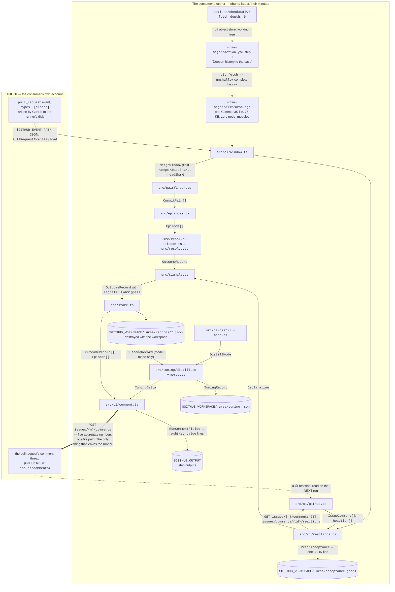

# The resolver as a GitHub Action — stage one of the surfaces

Engineer seat, 2026-10-05, built on the handoff from `asc/chair:ursa`
("Build stage one of the surfaces: the resolver as a GitHub Action").
Source design: `docs/design/product-plan.md` §1 (the second launch mode),
§8 (the GitHub spine), §9 (tooling and the container), §14.2 (the
pull-request comment and the thumbs-up mark). The why is in
`docs/prfaq/overlay.md`, whose press release says the resolver "could
tell you what survived in your code, but it needed you to finish the
project and run a command afterward." This surface removes the command.

Held to the engineering-artifact standard in `prompts/engineer-agent.md`:
all six elements are below, in order, and each is about code that exists
on this branch rather than code that is planned.

**One sentence of scope.** A consumer repository adds one workflow file.
From then on, every merged pull request in that repository produces
outcome records on the consumer's own runner and exactly one comment on
the pull request carrying five fields in a fixed order, and nobody runs
anything by hand.

**What this surface deliberately does not do.** It does not push records
anywhere. It does not install anything on the runner. It does not read
the chat trace, because a runner has no session log — that is the
overlay's bridge (`ursa-major/src/bridge/`, plan §16.2), and the two
surfaces stay separate. It does not infer a verdict from a merge.

---

## 1. System diagram

Every node below is a real file, process, or store on this branch. Every
edge is labelled with the type name, file format, or HTTP request that
actually crosses it. Three zones, and exactly one boundary crossing that
leaves the consumer's runner.



Reading the diagram, node by node, in the order the run executes:

| Node | What it is | What it hands on |
|---|---|---|
| `pull_request` event | the JSON file GitHub writes before the job starts, path in `$GITHUB_EVENT_PATH` | the merge's base and head commit hashes, the pull request number, whether it merged |
| `actions/checkout@v5` | the consumer's own checkout step, in their workflow, not in the Action | a git object store and working tree in `$GITHUB_WORKSPACE` |
| `action.yml` step 1 | a `git fetch --unshallow` guarded by a test for the `shallow` marker file | a complete history, because the resolver needs both sides of every commit pair |
| `dist/ursa.cjs` | the bundled command-line tool, run by the runner's own `node` | the `ci` subcommand's whole execution |
| `src/ci/window.ts` | turns the event payload into a git revision range | a `MergeWindow`, including the squash-merge degradation |
| `src/ci/reactions.ts` | finds the previous run's comment and reads its reactions | a `PriorAcceptance`, and the `Declaration` the records carry |
| `src/ci/github.ts` | the four REST calls, through Node's built-in `fetch` | `IssueComment[]`, `Reaction[]`, the posted comment |
| `src/pairfinder.ts` | walks the window for commits marked as agent-generated and the human commits that edited them | `CommitPair[]` |
| `src/episodes.ts` | one work unit per commit pair, boundaries explicit | `Episode[]` |
| `src/resolve-episode.ts` | reads both sides' file content out of git and calls the resolver | one `OutcomeRecord` per unit |
| `src/signals.ts` | turns each edited span into a correction, and attaches the acceptance declaration | `LabSignals` |
| `src/ci/distill-mode.ts` | decides whether a model is reachable at all | a `DistillMode`, either `model` or `ci-no-model` |
| `src/ci/comment.ts` | the five fields, in fixed order, zeros printed | the comment body and the step outputs |
| `.ursa/records/*.json` | the outcome records, on the runner's disk | nothing; the workspace is destroyed when the job ends |
| `.ursa/acceptance.jsonl` | the append-only log of declared acceptances, one JSON object per line | nothing; same fate |
| `$GITHUB_OUTPUT` | the file GitHub reads to populate `steps.<id>.outputs` | the consumer's own later workflow steps |

**The one crossing worth reading twice** is the double edge into the
comment thread. It carries five aggregate numbers and one file path,
written by the consumer's own `GITHUB_TOKEN` to the consumer's own pull
request. No raw diff, no commit message body, no file content, and no
Ursa-operated compute at any point in the diagram. The dotted edge back
is a reaction somebody chose to leave, read on a later run.

---

## 2. Interfaces at every component boundary

These are the signatures a caller writes against, copied from the code on
this branch, not paraphrases of it.

**The merge window** — `ursa-major/src/ci/window.ts`:

```ts
export type MergeStyle = 'merge-commit' | 'squash' | 'unknown'

export interface MergeWindow {
  prNumber: number
  repo: string
  baseSha: string
  headSha: string
  mergeCommitSha: string | null
  style: MergeStyle
  /** the git revision range to hand findCommitPairs */
  range: string
  /** why this range and not another, carried onto the record */
  note: string
}

export class NotAMergedPullRequest extends Error {}

export function mergeWindow(
  payload: PullRequestEventPayload,
  opts?: { parentCountOf?: (sha: string) => number }
): MergeWindow

export function mergeWindowFromEvent(eventPath: string, repoPath: string): MergeWindow
export function parentCountOf(repoPath: string, sha: string): number
```

**The pair finder's new option** — `ursa-major/src/pairfinder.ts`. One
field added to an interface that already existed; the function's name and
return type are unchanged:

```ts
export interface PairFinderOptions {
  agentTrailerPattern?: RegExp
  agentAuthorPattern?: RegExp
  /** a git revision range (`<base>..<head>`) to walk instead of every ref */
  range?: string
}

export function findCommitPairs(repoPath: string, opts?: PairFinderOptions): CommitPair[]
export function listCommits(repoPath: string, range?: string): CommitInfo[]
```

**CI mode for the distiller** — `ursa-major/src/ci/distill-mode.ts`:

```ts
export type DistillMode =
  | { kind: 'model'; model: string; reason: string }
  | { kind: 'ci-no-model'; reason: string }

export interface DistillModeOptions {
  claudeOnPath?: () => boolean
  model?: string
}

export function selectDistillMode(
  env: Record<string, string | undefined>,
  opts?: DistillModeOptions
): DistillMode

export function claudeOnPath(): boolean

/** satisfies DistillRunner; returns '{"axioms": []}' */
export const noModelRunner: DistillRunner
```

**The run comment** — `ursa-major/src/ci/comment.ts`:

```ts
export const RUN_COMMENT_MARKER = '<!-- ursa-major:run-comment:v1 -->'

export interface TuningDelta {
  unitsAdded: number
  unitsReinforced: number
  mode: 'distilled' | 'ci-no-model'
  reason: string
}

export interface RunCommentFields {
  unitsFound: number
  unitsResolved: number
  charsSurvivedVerbatim: number
  charsSurvivedEdited: number
  mostCorrectedArtifact: string | null
  mostCorrectedChars: number
  tuningDelta: TuningDelta
}

export interface RunCommentContext {
  prNumber: number
  repo: string
  range: string
  windowNote: string
  declarationBasis: string
  recordsPath: string
  runUrl: string | null
}

export function runCommentFields(
  records: OutcomeRecord[],
  episodes: Episode[],
  tuningDelta: TuningDelta
): RunCommentFields

export function renderRunCommentFieldTable(f: RunCommentFields): string
export function renderRunComment(f: RunCommentFields, ctx: RunCommentContext): string
```

**Reading acceptance off the previous comment** —
`ursa-major/src/ci/reactions.ts`:

```ts
export interface SatisfactionMark {
  step: number
  polarity: 'positive'
  source: 'pr-reaction'
  recordedAt: string
}

export interface PriorAcceptance {
  comment: PriorRunComment
  thumbsUp: number
  thumbsUpBy: string[]
  thumbsDown: number
  declaredAt: string | null
  mark: SatisfactionMark | null
}

export function findPriorRunComment(comments: IssueComment[], marker: string): PriorRunComment | null
export function readAcceptance(comment: PriorRunComment, reactions: Reaction[], now?: string): PriorAcceptance
export function declarationFromReaction(prior: PriorAcceptance | null): Declaration
```

`Declaration` is the existing type from `ursa-major/src/signals.ts`;
nothing about it changed. `accepted: true` requires a 👍.

**The GitHub calls** — `ursa-major/src/ci/github.ts`. Four calls and no
others, so the token's blast radius is readable at a glance:

```ts
export interface GitHubApi {
  listRepoRunComments(): Promise<IssueComment[]>
  listPrComments(prNumber: number): Promise<IssueComment[]>
  listReactions(commentId: number): Promise<Reaction[]>
  postComment(prNumber: number, body: string): Promise<IssueComment>
  patchComment(commentId: number, body: string): Promise<IssueComment>
}

export function githubApi(opts: {
  repo: string
  token: string
  baseUrl?: string
  fetchImpl?: typeof fetch
}): GitHubApi

export class GitHubApiError extends Error {
  constructor(status: number, endpoint: string, message: string)
}
```

**The CI launch itself** — `ursa-major/src/ci/run.ts`:

```ts
export interface CiOptions {
  projectPath: string
  eventPath: string
  repo: string
  token: string
  apiBaseUrl?: string
  runUrl?: string | null
  minChars?: number
  env?: Record<string, string | undefined>
  post?: boolean
  outputsPath?: string | null
  api?: GitHubApi
  log?: (line: string) => void
}

export interface CiResult {
  exitCode: number
  window: MergeWindow | null
  fields: RunCommentFields | null
  comment: string | null
  commentUrl: string | null
  priorAcceptance: PriorAcceptance | null
  declaration: Declaration
  mode: DistillMode
  recordPaths: string[]
}

export function runCi(opts: CiOptions): Promise<CiResult>
export function renderStepOutputs(fields: RunCommentFields, commentUrl: string | null): string
```

`api` and `log` exist so the end-to-end test drives the whole run against
a fake GitHub with no network, which is how the 401-on-no-token defect
was found.

**The Action's own boundary** — `ursa-major/action.yml`. Inputs and
outputs are the contract a consumer workflow writes against:

| Input | Default | Meaning |
|---|---|---|
| `project-path` | `${{ github.workspace }}` | the checked-out repository to resolve |
| `github-token` | `${{ github.token }}` | posts the comment and reads the 👍; needs `pull-requests: write` |
| `min-chars` | `200` | smallest generated-character count worth a record; matches the local launch |
| `post-comment` | `true` | `false` prints the comment in the job log instead of posting it |
| `anthropic-api-key` | `''` | optional; with no key the distiller runs in CI mode |

| Output | Example value | Meaning |
|---|---|---|
| `units-resolved` | `1` | work units that became outcome records |
| `units-found` | `1` | work units found in the window, resolved or not |
| `chars-survived-verbatim` | `27` | characters of generated text kept unchanged |
| `chars-survived-edited` | `0` | characters of generated text kept after editing |
| `most-corrected-artifact` | `` (empty) | file with the most edited characters; empty string when none, which is this fixture's case |
| `tuning-delta` | `0/0` | preference units added, then reinforced |
| `tuning-mode` | `ci-no-model` | `distilled` if a model interpreted; `ci-no-model` if none was reachable |
| `comment-url` | `https://github.com/…#issuecomment-99` | the run comment; empty string when `post-comment: false` |

---

## 3. On-disk layouts

### 3.1 In this repository

```
ursa-major/
  action.yml                      the reusable composite Action
  build/bundle.mjs                the esbuild script that writes the bundle
  dist/ursa.cjs                   the committed single-file CLI, 168,111 bytes
  examples/resolve-on-merge.yml   the consumer workflow, copy-paste ready
  src/ci/
    window.ts  reactions.ts  github.ts  comment.ts  distill-mode.ts  run.ts
    ci.test.ts                    23 tests
  src/resolve-episode.ts          extracted from src/bin/ursa.ts, shared by both launches
```

`dist/ursa.cjs` is committed on purpose. A generated file in version
control is normally a smell; here it is the product. A runner that has to
fetch the bundle from a registry is a runner that can be blocked by the
registry, and the whole point of the handoff was that the resolver never
blocks on what a runner lacks. `npm run bundle:check` rebuilds it into
memory and fails if the committed bytes differ, so the file cannot drift
from the source silently.

### 3.2 On the runner, inside `$GITHUB_WORKSPACE`

```
.ursa/
  episodes.json          the work-unit index for this window
  records/<id>.json      one outcome record per resolved unit
  acceptance.jsonl       append-only; one line per declared acceptance read
  tuning.json            written only in model mode
```

All of it is destroyed when the job ends, and `.ursa/` is already in this
repository's `.gitignore`. Nothing under it is uploaded, committed, or
sent anywhere.

### 3.3 A real example payload

From the end-to-end run of `dist/ursa.cjs` recorded in pull request #92's
description. The project directory is a throwaway `mktemp -d`, so the
record id's slug is that directory's name; it is written below in the
placeholder form the standard's redaction rider requires, and the commit
hashes are truncated to seven characters.

`.ursa/records/<project-slug>-2026-10-08-e70e06c.json`, abridged to the
fields this surface reads:

```json
{
  "schemaVersion": "0.1.0",
  "task": { "id": "<project-slug>-2026-10-08-e70e06c", "finished": true, "generatedAt": "2026-10-08T03:02:52Z" },
  "stats": {
    "finalChars": 68,
    "coveredChars": 63,
    "byClass": {
      "survived_verbatim": { "spans": 2, "chars": 27, "pct": 0.429, "pctOfFinal": 0.397 },
      "survived_mutated": { "spans": 0, "chars": 0, "pct": 0, "pctOfFinal": 0 },
      "no_generation_provenance": { "spans": 1, "chars": 36, "pct": 0.571, "pctOfFinal": 0.529 }
    },
    "generated": { "totalChars": 42, "charsWritten": 47, "survivedChars": 27, "deletedChars": 15, "deletedPct": 0.357 },
    "perFile": [
      { "path": "digest.js", "coveredChars": 63,
        "byClass": { "survived_verbatim": 27, "survived_mutated": 0, "no_generation_provenance": 36 } }
    ]
  },
  "signals": {
    "method": "auto-detected",
    "episode": {
      "steps": 1, "generations": 1, "accepted": null, "acceptanceStatedInChat": false,
      "acceptanceBasis": "undeclared: no reaction has been left on this run comment yet. Retention is NOT acceptance."
    },
    "oneShotCorrections": [
      { "step": 1, "domain": "digest.js",
        "text": "AGENT: return 'DIGEST — the latest research, summarized for you.\\n' + summary\nFINAL: return 'The frontier, read for you.\\n' + summary" }
    ],
    "notes": [
      "label-stage record (git commit pair): corrections appear once, as edits;",
      "recurrence and loops are unobservable without the chat trace.",
      "CI launch: merge style undetermined: window is the pull request's own commits, 444e9e2..a8f10e5"
    ]
  }
}
```

`.ursa/acceptance.jsonl`, one line, from the end-to-end test's fake
GitHub:

```json
{"schemaVersion":"0.1.0","commentUrl":"https://github.com/o/r/pull/6#issuecomment-11","commentId":11,"commentPostedAt":"2026-10-04T10:00:00Z","thumbsUp":1,"thumbsUpBy":["alexandrapaiz"],"declaredAt":"2026-10-04T11:00:00Z","mark":{"step":0,"polarity":"positive","source":"pr-reaction","recordedAt":"2026-10-04T11:00:00Z"},"readAt":"2026-10-05T03:42:00Z"}
```

`$GITHUB_OUTPUT`, written by the run that produced the numbers:

```
units-resolved=1
units-found=1
chars-survived-verbatim=27
chars-survived-edited=0
most-corrected-artifact=
tuning-delta=0/0
tuning-mode=ci-no-model
comment-url=
```

### 3.4 The run comment, verbatim

This is the real output of the end-to-end run, not a mock-up. The five
rows are the contract: same fields, same order, every run, zeros printed.

```markdown
<!-- ursa-major:run-comment:v1 -->

**Ursa Major resolved this merge.** Pull request #7 in `alexandrapaiz/ursa-demo`.

| Field | Value |
| --- | --- |
| Units resolved — work units found in this merge, and how many became outcome records | 1 of 1 |
| Characters survived verbatim — generated text you kept unchanged | 27 |
| Characters survived edited — generated text you kept after editing it; the edit is the correction | 0 |
| Most corrected artifact — the file carrying the most edited characters | none — no generated text was edited in this window |
| Tuning delta — preference units this run added to, or reinforced in, the tuning store | 0 new, 0 reinforced (no interpretation ran: no model credential in the environment (looked for ANTHROPIC_API_KEY, CLAUDE_CODE_OAUTH_TOKEN)) |

That's the part worth noticing: not what got written, what got kept.
```

followed by a collapsed detail block carrying the commit window, why that
window, the acceptance declaration, the records path, and the workflow
run link, and then the one line that asks for the reaction:

> React 👍 on this comment if the merged work is what you wanted. Ursa
> reads that reaction on the next run and records it as a declared
> acceptance. Leaving it alone records nothing: silence stays undeclared,
> and retention is never read as acceptance.

On a merge where nothing resolved, all five rows are still there, reading
`0 of 0`, `0`, `0`, `none — no generated text was edited in this window`,
and `0 new, 0 reinforced`, and the sentence under the table changes to
say the zero is a reading rather than a failure.

---

## 4. Exact commands

Every literal invocation this surface executes or that a person runs
against it. Nothing here is a description of what running it "does."

**What the Action runs internally**, from `ursa-major/action.yml`:

```bash
# step 1, only when the checkout was shallow
git fetch --quiet --unshallow origin || git fetch --quiet --depth=500 origin

# step 2, the whole resolve, one invocation
node "$GITHUB_ACTION_PATH/dist/ursa.cjs" \
  ci "$GITHUB_WORKSPACE" \
  --repo "$GITHUB_REPOSITORY" \
  --event "$GITHUB_EVENT_PATH" \
  --run-url "$GITHUB_SERVER_URL/$GITHUB_REPOSITORY/actions/runs/$GITHUB_RUN_ID" \
  --min-chars 200 \
  | tee "$RUNNER_TEMP/ursa-ci.log"
```

**What the resolver shells out to**, unchanged from the local launch
(`src/pairfinder.ts`), with the range the new option supplies:

```bash
git -C <repo> log <baseSha>..<headSha> --reverse --topo-order --date=iso-strict \
  --pretty=format:%H%x09%an%x09%ae%x09%aI%x09%P%x09%(trailers:key=Co-Authored-By,valueonly,separator=|)%x09%s
git -C <repo> show --name-only --format= <sha>
git -C <repo> show <sha>:<path>
git -C <repo> rev-list --parents -n 1 <mergeCommitSha>
```

**Building and checking the bundle**, from `ursa-major/`:

```bash
npm install                 # once, for the toolchain; the runner needs none of this
npm run bundle              # writes dist/ursa.cjs and prints its sha256
npm run bundle:check        # rebuilds into memory, fails if the committed bytes differ
npm test                    # 472 tests, 28 of them this surface's
npx tsc --noEmit -p tsconfig.json
```

**Reproducing the end-to-end run locally**, which is how the output in
§3.3 and §3.4 was produced:

```bash
cd ursa-major && npm run bundle
WORK=$(mktemp -d) && cd "$WORK"
git init -q -b main
printf '# project\n' > README.md && git add . && git commit -q -m Base
printf 'export function digest() {\n  return "DIGEST"\n}\n' > digest.js
git add . && git commit -q -m "Generate digest module

Co-Authored-By: Claude <noreply@anthropic.com>"
sed -i 's/DIGEST/The frontier, read for you./' digest.js
git add . && git commit -q -m "Tighten digest prose"
cat > event.json <<EOF
{"repository":{"full_name":"alexandrapaiz/ursa-demo"},
 "pull_request":{"number":7,"merged":true,"merge_commit_sha":null,
  "base":{"sha":"$(git rev-parse HEAD~2)"},"head":{"sha":"$(git rev-parse HEAD)"}}}
EOF
# --min-chars 1 is load-bearing on this fixture and was not needed before the
# reconciliation. digest.js is a 42-character generation, and the default
# --min-chars 200 drops it, so the run exits 0, reports "0 of 1", and the
# comment names the floor as the reason. See §8.2 and §8.3.
GITHUB_OUTPUT="$WORK/step-output.txt" \
  node <path-to>/ursa-major/dist/ursa.cjs ci "$WORK" \
  --repo alexandrapaiz/ursa-demo --event "$WORK/event.json" --no-post --min-chars 1
cat "$WORK/step-output.txt"
```

**Installing it on a consumer repository**, which is the whole consumer
side:

```bash
mkdir -p .github/workflows
curl -fsSL https://raw.githubusercontent.com/alexandrapaiz/Ursa/main/ursa-major/examples/resolve-on-merge.yml \
  -o .github/workflows/ursa-resolve.yml
git add .github/workflows/ursa-resolve.yml
git commit -m "Resolve every merged pull request with Ursa Major"
```

**Dry-running it on a repository nobody wants commented on yet** — set
one input in that workflow:

```yaml
      - uses: alexandrapaiz/Ursa/ursa-major@main
        with:
          post-comment: 'false'
```

---

## 5. Tooling

Every tool carries its version, its job here, and why it beat the
alternative that was actually considered.

| Tool | Version | Job in this surface | Why over the alternative |
|---|---|---|---|
| Node.js | 22, the runner's own | executes `dist/ursa.cjs` | already installed on `ubuntu-latest`, `macos-latest` and `windows-latest`; `actions/setup-node` would add a step and a cache lookup to every merge for a runtime that is already there |
| esbuild | 0.28.2, from the `^0.28.0` range in `ursa-major/package.json` (`^0.25.10` until the 2026-10-08 reconciliation, which moved it to the major vitest's own vite already resolves, because npm cannot place two esbuild majors in this tree) | bundles `src/bin/bundle-entry.ts` and everything it imports into one CommonJS file | one dependency, no configuration file, sub-second builds, and it inlines the `diff` package the resolver needs. Rollup needs a plugin chain for CommonJS output and TypeScript; `tsc` emits a file tree rather than one file; `ncc` is archived; Bun's bundler would add a second runtime to a repository that targets Node |
| CommonJS output format | — | the bundle's module format | `.cjs` is unambiguous wherever the file is copied. A `.js` next to this repository's `"type": "module"` would be read as ESM, and the bundle has no `package.json` beside it to say otherwise |
| Node's global `fetch` | built-in since Node 18 | the four GitHub REST calls | needs no install, which is the whole constraint. `@octokit/rest` and `@actions/github` would each have to be installed on the runner or inlined; the `gh` binary is guaranteed only on GitHub-hosted runners, not self-hosted ones |
| system `git` via `execFileSync` | the runner's installed git | the pair finder's `log`, `show` and `rev-list` calls | the repository is already a git checkout, and `src/pairfinder.ts` and `src/tuning/distill.ts` already shell out exactly this way — one pattern, not two. `isomorphic-git` reimplements git in JavaScript for no gain here |
| composite action (`runs: using: composite`) | — | the Action's own form | the consumer's checkout runs first with their own git and token, and the YAML they read before it runs is auditable. A `docker` action makes checkout awkward and would pull an image that does not exist yet (plan §9 names `ghcr.io/alexandrapaiz/ursa-major`, unbuilt) |
| `node:util` `parseArgs` | built-in since Node 18.3 | parses `ursa ci <project> --repo --event --run-url --min-chars --no-post` | `src/bin/ursa.ts` already parses this way for `run` and `bridge`; adding `commander` for a third subcommand would be a dependency in the bundle |
| vitest | 2.1.8, pinned | runs the 23 tests in `src/ci/ci.test.ts` | already this repository's test runner, 36 tests green on it before this change and 59 after |
| `actions/checkout` | v5, in the example workflow only | gives the runner the git object store | v5 is current; the Action itself pins nothing, because the consumer owns their checkout step |

### Deviation from the plan, stated rather than buried

Product plan §9 specifies that the Action "runs the container image from
§9 locally to the runner" — `docker run` against
`ghcr.io/alexandrapaiz/ursa-major:<version>`. This surface runs a
committed single-file bundle with the runner's own `node` instead. Two
reasons, both load-bearing:

1. The handoff that commissioned this work says, in those words, to
   bundle the command-line tool into one file so runners need no install,
   because the resolver must never block on what a runner lacks. A
   container pull is exactly such a block.
2. The image does not exist. Nothing has ever been published to
   `ghcr.io/alexandrapaiz/ursa-major`, so an Action that pulled it would
   fail on its first run in every consumer repository.

The §9 one-image invariant is not abandoned. When the image is built, it
can run the same `dist/ursa.cjs` as its entrypoint, and `action.yml`
gains a `use-container` input that swaps the `node` step for a
`docker run` step without changing a single interface in §2. The bundle
is the faster path to a working surface, not a different architecture.

---

## 6. Terms used above

Defined in place, so no cell or label stands as a bare noun.

| Term | Definition |
|---|---|
| **outcome record** | the project's core data artifact: one finished piece of work joined backward to every model generation that fed it, with each span of the final text classified by what happened to it. The type is `OutcomeRecord` in `ursa-major/src/types.ts` |
| **work unit** | one `Episode`: a generated commit paired with the next human commit that edited an overlapping file. The comment calls these "units resolved" because "episode" means nothing to a reader outside the project |
| **commit pair** | the two commits of a work unit: `generatedSha`, carrying an agent marker, and `finalSha`, the human edit of it |
| **agent marker** | the `Co-Authored-By` trailer, or failing that the author name, that identifies a commit as model-generated. Matched by `src/pairfinder.ts`'s default patterns |
| **survived verbatim** | span class `survived_verbatim`: generated text present in the final file, unchanged |
| **survived edited** | span class `survived_mutated`: generated text present in the final file after the person edited it. The edit is the correction, expressed as a change rather than a complaint |
| **most corrected artifact** | the file path with the largest total of `survived_mutated` characters across this run's records. Ties break on the path, so two runs over the same data name the same file |
| **tuning delta** | how many preference units (axioms in `TuningRecord`) this run added, and how many existing ones it reinforced with new evidence |
| **tuning mode** | `distilled` when a model ran the interpretation pass; `ci-no-model` when none was reachable. The distinction exists so a zero delta from an absent model never reads as a model finding nothing |
| **CI mode** | the distiller's behaviour when no model credential and no `claude` binary are present: resolve the records, run no interpretation pass, report a zero delta with the reason attached |
| **merge window** | the git revision range one merged pull request contributed, `<baseSha>..<headSha>`, or the single collapsed commit when the merge was squashed |
| **squash degradation** | when a pull request is squash-merged, the branch's commit sequence collapses into one commit, so the generation-to-mutation chain is unrecoverable. The window becomes that one commit and the record's notes say so, rather than the run failing (plan §7, risk 3) |
| **declaration** | the `Declaration` type in `src/signals.ts`: somebody's own verdict on the work, `accepted: true`, `false`, or `null` for never stated, with the basis in prose |
| **declared acceptance** | a verdict somebody stated. On this surface, a 👍 on the run comment. A merge is not one. Elapsed time is not one |
| **undeclared** | `accepted: null`. Nobody said the work was right and nobody said it was wrong. It stays this way forever unless somebody declares |
| **satisfaction mark** | plan §14.2's `SatisfactionMark`, here with `source: 'pr-reaction'`. It raises an axiom's evidence count; it never gates acceptance |
| **step output** | a `key=value` line written to the file named by `$GITHUB_OUTPUT`, which GitHub exposes to later workflow steps as `steps.<id>.outputs.<key>` |
| **composite action** | a GitHub Action made of shell and `uses` steps in YAML, run directly on the runner, as opposed to one that runs inside a container image |

---

## 7. Acceptance provenance, stated once

The rule this surface could most easily get wrong, so it is written down
rather than left to the code.

A 👍 on pull request #6's run comment is a verdict about pull request
#6's work. It is **not** a verdict about pull request #7's work, even
though #7's run is what reads it. So:

- The reaction is appended to `.ursa/acceptance.jsonl` carrying the
  comment URL, the comment id, who reacted, and when, which is enough for
  a later pass to join it to the records it belongs to.
- The `Declaration` carried into **this** run's records comes only from a
  👍 on **this** pull request's own run comment, which happens when the
  Action is re-run after somebody reacted. Otherwise the records say
  undeclared.
- Spreading one merge's verdict onto another merge's text would be
  exactly the inference `docs/vision.md` §0b refuses, and it would
  manufacture endorsement out of a reaction nobody aimed at that work.

A 👎 is read, counted, and reported in the declaration's basis, and
deliberately not treated as a verdict. Ursa has no verified meaning for
it: it could be aimed at the work, at the numbers, or at the comment
itself, and guessing would be the stated-preference survey the vision
rejects. Naming it in the basis means the next design pass can see it
happened.

---

## 8. What is not done, and what it would take

### 8.1 Honest list, so the project manager can plan rather than discover

1. **Nothing has run on a real GitHub runner yet.** The end-to-end
   evidence is the bundle executing against a real git repository and a
   fake GitHub, plus 23 tests. The Action's own YAML is validated as YAML
   and read line by line, which is not the same as a green run. First
   real run requires a workflow file in `.github/workflows/`, which this
   seat cannot write (see `docs/agents/pending-workflow-changes.md`).
2. **The comment's stated numbers have never been compared against a
   second merge.** The surface's value is comparability across merges,
   and one run cannot demonstrate it.
3. **The pull-request adapter on `engineer/2026-10-05-generated-denominator`
   (pull request #77) is richer than the commit-pair path this Action
   uses.** That branch's `src/adapters/github-pr.ts` reads review
   comments as stated corrections and detects intervening merges. When it
   lands, `ursa ci` should call `pairsFromPullRequest` instead of
   `findCommitPairs`, and `MergeWindow` already carries everything that
   adapter's options need. No interface in §2 changes.
4. **`tuning.json` on a runner is written and then destroyed with the
   workspace.** In model mode the delta is real for that run and lost
   afterward. Persisting it is the next surface's problem (the managed
   block in `CLAUDE.md`/`AGENTS.md`, plan §8), not this one's.
5. **The `ghcr.io` image is unbuilt**, so §5's deviation stands until it
   is.

### 8.2 What the 2026-10-08 reconciliation changed in this document

This artifact was written on 2026-10-05 against the branch
`ursa-engineer/2026-10-05-message`. By 2026-10-07 that branch no longer
merged into `main`, and the reconciliation that landed it had to change
four of the numbers quoted above. They are corrected in place rather than
annotated line by line, and this section says what moved and why, because
a payload a reader cannot reproduce is worse than no payload.

1. **`src/resolve-episode.ts` is now the one definition of the resolve
   step, and it is `main`'s, not this branch's.** The branch extracted the
   function out of `src/bin/ursa.ts` on 2026-10-05 to keep the CI launch
   from importing the CLI entrypoint. That reason still holds and the
   module stays. What changed is whose body is inside it: between
   2026-10-05 and 2026-10-07 `main` grew the file-level import refusal
   (`src/vendored.ts`), descent corroboration (`src/corroborate.ts`), the
   deploy detector (`src/deploy.ts`) and the exclusion-only record, none
   of which the branch's copy had. Merging the branch as written would
   have given `ursa ci` a resolver four features older than `ursa run`,
   under the same name and the same signature, with no test comparing the
   two. The stale copy is deleted. `src/bin/ursa.ts` re-exports the three
   functions that eight test files and `src/adapters/cli.ts` import from
   it, so no caller moved.

2. **The record this document quotes is smaller, because the
   generation-side character accounting was fixed on `main` on
   2026-10-04.** `stats.generated.totalChars` counts the characters a
   generation wrote, and the fix stopped a final-side total from being set
   beside it (`src/invariants.ts`; the run that claimed 239,976 characters
   survived out of 239,841 generated). The §4 fixture's `digest.js` is a
   42-character generation, so §3.3's figures fall from 101 and 128
   characters to 27 and 0, and the span the branch labelled
   `survived_mutated` is now `no_generation_provenance`: the edited line
   scores below `THETA_HIGH` against the generated one, and `main` no
   longer reaches for the nearest match above a looser bar.

3. **The §4 recipe now needs `--min-chars 1`.** At the default
   `--min-chars 200`, a 42-character generation is filtered out and the run
   exits 0 reporting `0 of 1`. That is the filter working. It is also a
   recipe that teaches a reader the surface is broken, so the flag is in
   the command and this is why. Running the recipe at the default is what
   found the defect in §8.3.

4. **The bundle is 168,111 bytes, up from 75,631, and esbuild is 0.28.2.**
   The size is the four features in item 1 arriving in the same file; the
   requires are still only `node:child_process`, `node:fs`, `node:path`
   and `node:util`, so the no-install property holds. The esbuild range
   moved from `^0.25.10` to `^0.28.0` because `vitest@5.0.2` resolves
   `esbuild@~0.28.0` through vite, and npm could not place the two majors
   side by side in this tree (`Cannot read properties of null (reading
   'edgesOut')` on `npm install --package-lock-only`).

Item 1 of §8.1 still stands: nothing has run on a real GitHub runner.
What ran on 2026-10-08 is the reconciled bundle against a throwaway git
repository and a fake GitHub, exit 0, five fields in the fixed order,
eight step outputs, 472 tests passing and `npm run bundle:check` current
at sha256 `db8ebdf7`.

### 8.3 The empty-window sentence was asserting a cause it had not checked

Found on 2026-10-08 by running §4's recipe at the default `--min-chars`,
which is the first time anyone ran it on a generation smaller than the
floor.

`renderRunComment` chose its closing sentence on `unitsResolved === 0`
alone and, on every zero, printed:

> Nothing resolved in this window. That is a reading, not a failure: no
> commit here carried an agent marker that a later human commit then
> edited.

The run that printed it also wrote `units-found=1` to `$GITHUB_OUTPUT`.
A commit did carry an agent marker and a later human commit did edit it;
the pair was found, resolved, and then dropped by `--min-chars`. So the
comment stated a cause it had no evidence for, in the same comment that
reported the evidence against it, and it sent the reader to go fix their
commit trailers when the fix was one flag. Three distinct facts were
collapsed into one sentence: no pair found at all (a question about
authorship), a pair found and dropped under the size floor (a question
about `--min-chars`), and a pair that resolved to nothing (a question
about the clone).

**The fix.** `src/ci/comment.ts` gains `emptyWindowSentence`, which keeps
the authorship sentence for `unitsFound === 0` and otherwise reports the
counts `src/ci/run.ts` now tracks per bound, carried on
`RunCommentContext.dropped` rather than in the five fields, because the
field order is fixed and a sixth row would break it. A caller that tracks
nothing gets "This run did not record which bound dropped them," which
says the run does not know instead of guessing. Five tests, one of them
asserting the five-field table and its order are untouched.

What the §4 recipe prints at the default now:

```
Nothing resolved in this window. That is a reading, not a failure: 1 work
unit was found, and it did not become a record. The reason: 1 carried
fewer than 200 generated characters, the `--min-chars` floor, which is
small enough that a survival figure over it would be noise.
```

This is the same class of defect as the two the branch's own description
reported finding by running the thing: a surface that reads as working
while saying something untrue. It was reachable only by executing the
documented recipe rather than the convenient variant of it.
