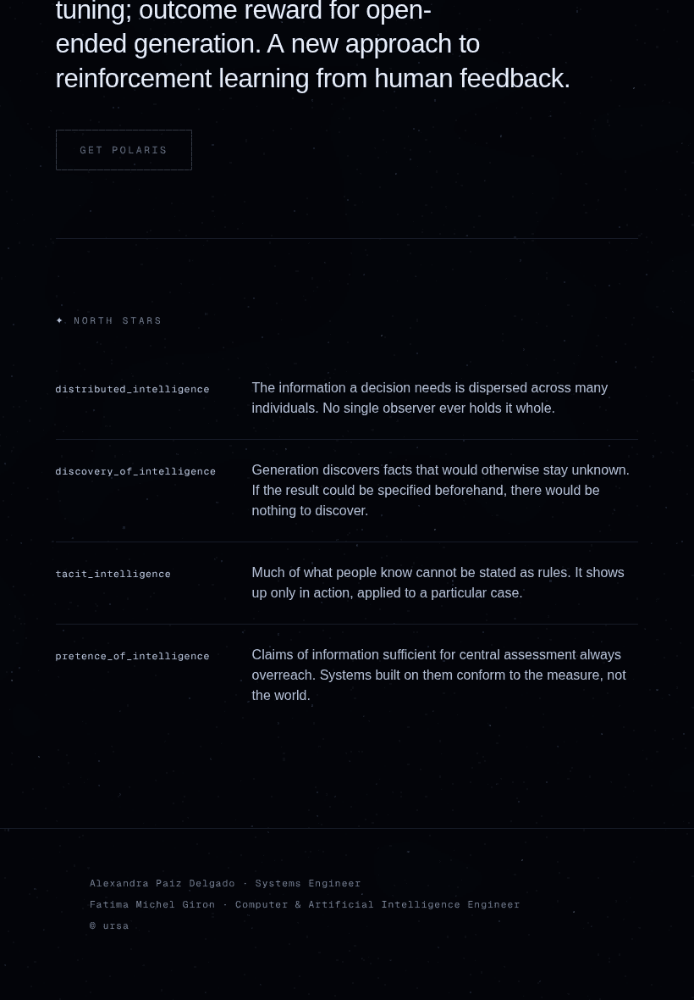
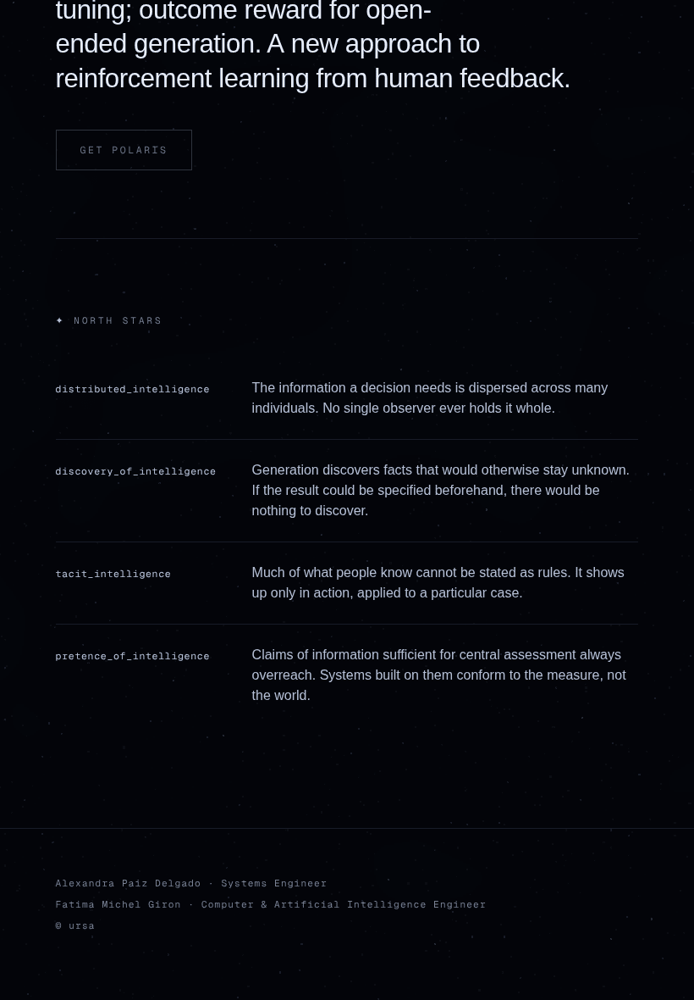
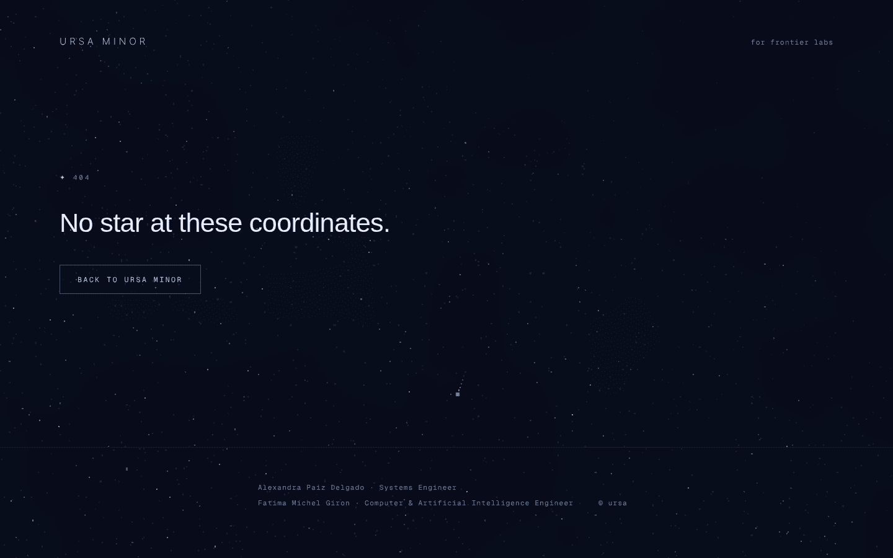
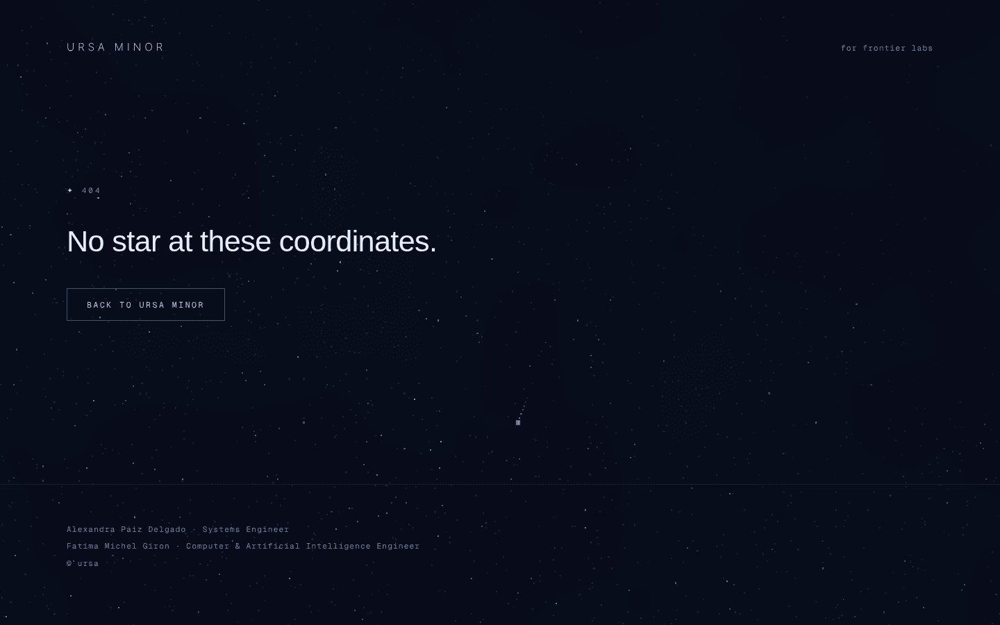
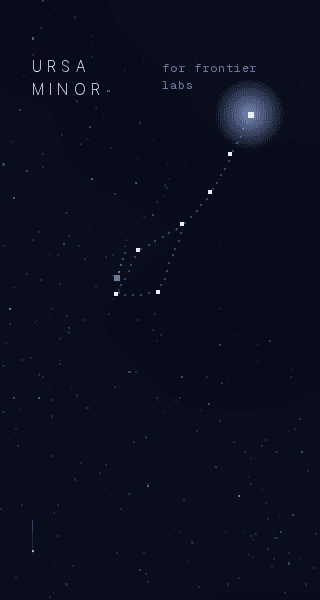
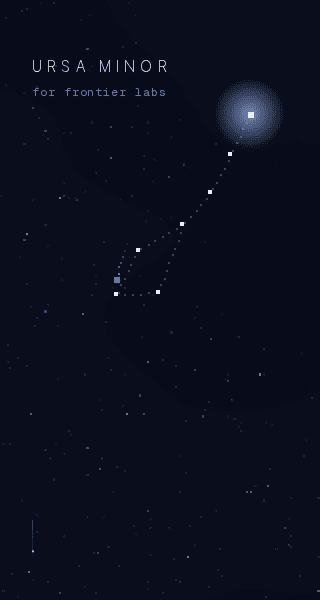
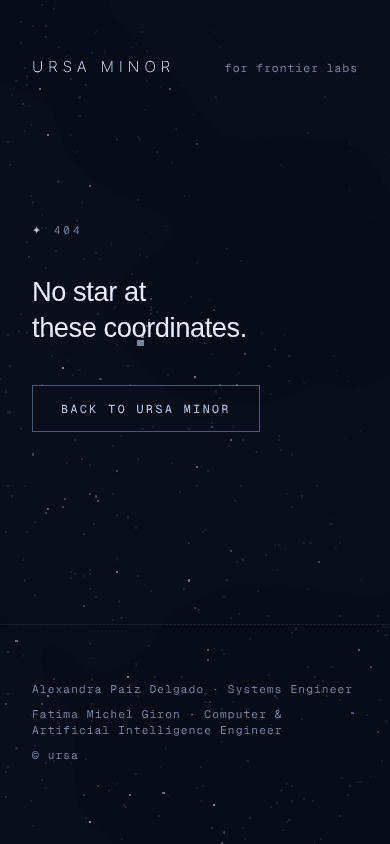
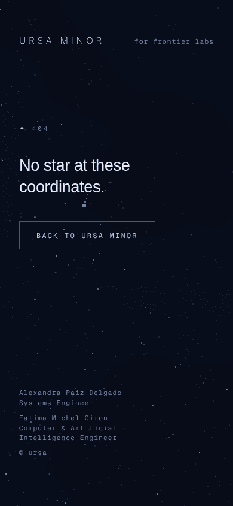

# Frontend visual review — 2026-10-01

Run under `prompts/frontend-agent.md`. Surface: the Ursa Minor site
(`ursa-minor/`, Next.js 16). `ursa-major/` is a CLI and has no frontend of
its own, so it is out of scope for a visual run.

Everything below was rendered in headless Chromium with WebGL running through
SwiftShader, so the starfield shader and the constellation canvas are the real
thing rather than the no-WebGL fallback. Forty-four screenshots at iPhone
390x844, iPad 820x1180 and desktop 1440x900, plus narrow-width probes at 320,
360, 375 and 414. Every one of them was read before anything was called fixed.

Harness: [`shots.mjs`](shots.mjs). The numbers in this record come from
[`probe-columns.mjs`](probe-columns.mjs),
[`probe-header.mjs`](probe-header.mjs) and
[`probe-linebreaks.mjs`](probe-linebreaks.mjs), all runnable against
`next start -p 3100`.

One capture note: these are viewport screenshots at scroll positions, never
`fullPage`. The sky is `position: fixed`, and `fullPage` flattens everything
below the first viewport height.

## Branch survey (L-E10)

The frontend lane had three open pull requests and nothing merged.

| PR | branch | state |
|---|---|---|
| #15 | `fe/2026-09-24-visual-review` | contrast fix, identity 404, tablet alignment |
| #35 | `fe/2026-09-28-visual-review-polish` | contrast, typography, wraps, scroll cue, CTA craft. Conflicts with #15 |
| #51 | `ursa-frontend/2026-09-30-window` | carried #15 into #35, captured a before set, then stopped |

This branch starts from #51's head, so merging it lands the whole line in
order. Nothing here reimplements work already sitting in those branches.

## What I found and fixed

### 1. The footer was written twice and the copies had drifted

Left edge of the credits against the left edge of the content above them,
measured, not estimated:

| width | home: `main` / credits | 404: content / credits |
|---|---|---|
| 390 | 32 / 32 | 32 / 32 |
| 820 | 65.6 / **106** | 65.6 / 65.6 |
| 1024 | 208 / 208 | 81.9 / **208** |
| 1440 | 416 / 416 | 96 / **416** |

Each page was misaligned at a width where the other was fine. The home
footer still carried `mx-auto max-w-2xl px-8` after `main` had moved to
`px-[clamp(2rem,8vw,6rem)]` with the centred column gated behind `lg`, so the
credits indented 40.4px through the whole tablet band. The 404 had inherited
the centred rule without having a reading column for it to agree with, so at
desktop the credits floated 320px inside the headline above them. The 404 had
also never received the stacked-credit fix from #35, so it still broke
mid-role at 390: `Fatima Michel Giron · Computer & / Artificial Intelligence
Engineer`.

One `SiteFooter` component now serves both, with a `column` prop for the page
that has a reading column. After the fix every width agrees on both routes.

| before (iPad 820) | after |
|---|---|
|  |  |

| before (404, desktop) | after |
|---|---|
|  |  |

### 2. The header collided at 320

The word-mark measures 140px and the tag 135px against 256px of usable width,
so the single nowrap row broke both of them internally and set the pieces
side by side with nothing between them: `URSA / MINOR` against `for frontier /
labs`, gap 0.

| width | before: mark / tag gap | after |
|---|---|---|
| 320 | **0**, both wrapped internally | stacked, each on one line |
| 360 | 22 | 22 |
| 375 | 37 | 37 |
| 390 | 52 | 52 |
| 414 | 73 | 73 |

The row now wraps, and neither item can break inside itself, so the tag drops
to its own line and the two read as a lockup. The minimum gap is 16px rather
than 24 so the break lands at 355 rather than 379, which leaves 360 and every
width above it exactly as it was.

| before (320) | after (320) |
|---|---|
|  |  |

### 3. `text-balance` made the 404 headline worse

The headline takes two lines at exactly one width, 390. Line widths there:

| setting | lines | widest |
|---|---|---|
| `text-wrap: balance` | 114 / 215 | 215 |
| `text-wrap: pretty` | 185 / 143 | 185 |
| plain wrapping | 185 / 143 | 185 |

The balancer produced both the wider maximum and the more lopsided pair, and
on screen it read as a stubby `No star at` above a long second line. Dropped
from that element only. The hero keeps `text-balance`, where it earns its
place: at 1440 it gives 636/578/570/488/577 against plain wrapping's
636/696/695/651/**181**, so it removes a 181px orphan last line.

| before (390) | after |
|---|---|
|  |  |

## Benchmark

Four sites, probed live for the durations, curves and focus treatments
actually computed on their own controls rather than recalled. Scripts in
[`benchmark/`](benchmark).

| site | most common transition | count |
|---|---|---|
| Linear | `color` 100ms `ease` | 38 |
| Linear | `border, background-color, color, box-shadow, opacity, filter, transform` 160ms `cubic-bezier(0.25, 0.46, 0.45, 0.94)` | 7 |
| Vercel | colour family 100ms `cubic-bezier(0.4, 0, 0.2, 1)` | 79 |
| Vercel | colour family 150ms, same curve | 35 |
| claude.com | `color` 200ms `ease` | 159 |
| claude.com | `background-color, color` 150/200ms `ease` | 58 |
| claude.com | `transform, background-color, border-color` 100ms `ease` | 3 |
| Elicit | `transform` 200ms `ease-in-out` | 1 |

Two things worth recording.

**Elicit's marketing site declares two transitions in total**, one transform
and one opacity, both 200ms. The bouncy feel the owner likes lives in the
application, not on the public pages. #35 reached the same conclusion and this
run confirms it independently, so anyone chasing that feel should be pointed
at the product rather than at elicit.com.

**Every one of the four defines focus once, as a site-level token.**
claude.com declares `:focus-visible { outline: 2px solid var(--color-focus);
outline-offset: 2px }` globally. Linear routes components through
`--focus-ring-outline`, Vercel through `--ds-focus-ring`. Not one of them
hangs focus styling off individual component classes. That is the observation
the refinement below comes from.

## The refinement

### One focus treatment for the whole site

Ours was declared twice, inside `.cta` and `.quiet-link`. Everything else
focusable fell through to the shadcn base ring left in `@layer base`:
`outline: auto 1px` at 50% grey with a 1px offset. On `#020308` that reads as
a thin grey box that belongs to no identity here, and it was not hypothetical:
the 404's word-mark link is the first tab stop on that page, and that is
exactly what it was getting.

A single unlayered `:focus-visible` rule now carries the ring, at the values
the two controls already used, so nothing that was already styled changes. It
beats `@layer base` because unlayered styles win over layered ones, and any
component can still override it on specificity. The two duplicate declarations
came out, so the change removes more CSS than it adds.

| before: first tab stop on the 404 | after |
|---|---|
|  |  |

The styled control is unchanged, keeping its wash, its brightened border and
the same ring: 

Only one refinement this run rather than two. The budget is a ceiling, and
this branch is already landing three runs' worth of unmerged work.

## Checked and found healthy

- **The hero mark is untouched.** No change to the dipper's coordinates, its
  edges, Polaris's pulse, or the portrait and landscape placement rules.
  Confirmed by reading the hero at all three viewports after every change.
- **Reduced motion.** Static sky, no shooting star, no cue animation, no
  transform on hover or press. Scroll darkening still applies, which is
  correct, since it is not motion.
- **No horizontal overflow** at 320, 360, 375, 390, 414, 820, 1024 or 1440.
- **No console errors** beyond the intentional 404 navigations.
- **The scroll cue** from #35 renders on both portrait viewports and clears on
  scroll.
- **The CTA hover** correctly does nothing, because the control ships
  disabled and the rule is gated on `:not(:disabled)`.

## Proposals, not implemented

1. **Stand up `docs/design/canon.md`, `ban-list.md` and `tuning.md`.** The
   charter asks every run to read all three before designing anything, and
   none of them exists in this repo. They were alexandria's and the seat's
   adaptation to Ursa did not bring them across. #35 raised this first and it
   is still open. Three runs have now worked from the identity as the charter
   states it directly plus what the site already is, which is workable for
   polish and will not hold for anything larger.

2. **The charter and the dispatch both say the identity is black and white.
   The site is not, and has not been since before this seat was activated.**
   It is a near-monochrome night palette with one accent: `--night #020308`,
   `--star #e8edf7`, `--dim #707fa0`, `--polar #a8c7fa`, `--line #141b2b`, set
   by the owner's own commits. Every run in this lane has protected that
   palette and introduced no colour, which is the right reading of "protect
   the identity, do not reinvent it", but the written rule and the shipped
   site disagree and a future run could read it the other way. Worth one line
   in `tuning.md` settling it.

3. **The disabled CTA renders at 3.9:1 at 11.52px** (sampled from the
   rendered pixels: label `rgb(92,110,143)` against field `rgb(8,12,25)`).
   WCAG exempts disabled controls so this is not a conformance failure, and
   brightening it would make a dead control look live. Raising it because
   `Get Polaris` is the only call to action on the page and today it is close
   to unreadable. The fix is a product decision about what that button should
   say while Polaris is unavailable, not a CSS change, so it stays a proposal.

4. **The reading column is centred under a left-aligned hero.** At 1440 the
   hero copy starts at 96 and the north stars at 416. #15 judged the gap wide
   enough to read as deliberate and this run did not reopen it. Flagging it
   only because it is the one composition question on the page that a ruling
   in `tuning.md` would close for good.
