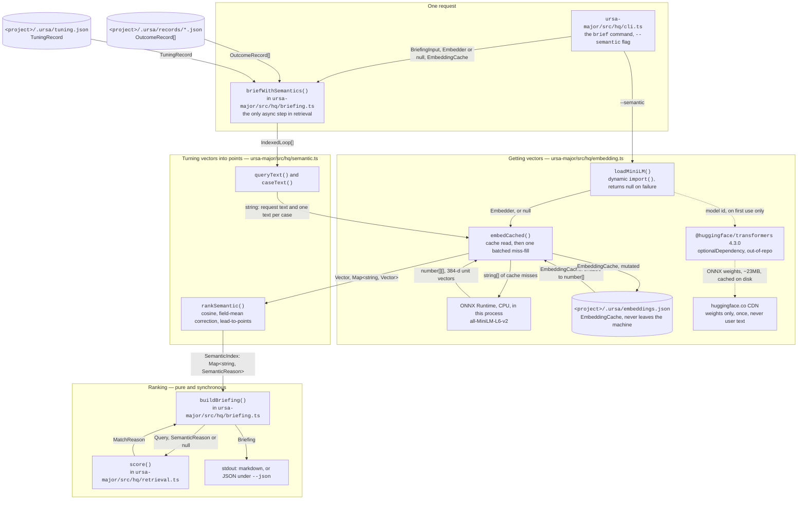

# Semantic retrieval for `nearestCases`

Sprint 2026-09-28 item 2. Closes step (c) of the accepted ledger entry
"Agentic-forward: Ursa as the agents' HQ" (docs/ideas.md, 2026-09-19),
which is the one sub-step PR #22 did not attempt. Implements the
retrieval decision in `docs/design/product-plan.md` §12 ("Classic AI
stack — where it belongs, and where it doesn't"), with two deviations
recorded in §6 below.

Held to the engineering-artifact standard in `prompts/engineer-agent.md`.

---

## 1. The problem, stated as the miss that produced it

`src/hq/briefing.ts` answers one question for an agent before it starts
work: *what has this owner already taught, that applies to the files I
am about to touch?* Its ranker, `src/hq/retrieval.ts`, is lexical. It
scores four signals and nothing else: the request's domain string
against the unit's domain string, the requested file paths against the
paths the unit was learned on, the file names of those paths ignoring
directory, and the count of query words that also occur in the unit's
own text.

That ranker is exact, cheap and auditable, and on the case it is built
for — the agent names a file this owner has actually been corrected on
— nothing beats it. It is also blind in a specific, reproducible way.

The fixture store in `src/hq/fixtures.ts` holds a correction loop whose
discovered specification reads *"entrance motion may reposition an
element by at most 8px; anything larger reads as breakage, not
polish."* That loop cost its owner three repeat requests to close. An
agent about to add an entrance animation to a new component asks for
domain `transitions` on file `src/components/Banner.tsx`.

`transitions` is not `motion`. It is not `animation` and not
`entrance`. `Banner.tsx` is not `page.tsx`. The four lexical signals
all score zero, the total falls under `MIN_RELEVANCE` (2, defined in
`briefing.ts`), and the briefing serves no cases at all. The lesson is
in the store, it is directly on point, and the agent is about to pay
for it a second time.

Closing that specific miss, without breaking the case the lexical
ranker already gets right, is the entire scope of this document.

**What this is not.** It is not a vector database, not a retrieval
service, and not a change to how rules are ranked. Rules stay lexical
(§7). Only `Briefing.nearestCases` is affected.

---

## 2. System diagram

Every node is a file that exists in this repository after this change,
or a process that actually runs. Every edge carries a named type or a
named file format, never a verb phrase.



**The two edges worth reading twice.**

The dotted pair is the only traffic that ever leaves the machine, and
it carries ONNX model weights in one direction and nothing in the
other. No prompt, no correction loop, no discovered specification, no
file path and no vector crosses it. That is the property plan §12's
phrase "raw case text never leaves the machine to be embedded remotely"
exists to protect, and it holds here exactly. It fires once per
machine: afterwards the weights are on disk and `--semantic` works
with the network unplugged.

The edge from `loadMiniLM` labelled **"Embedder, or null"** is the
other one. `null` is a supported value on that edge, not an error
state. It is what an offline machine, or an install that omitted the
optional dependency, produces, and the system's response to it is to
rank lexically and say so in the output (§5).

---

## 3. Interfaces at every component boundary

The signature a caller would actually write against, at each seam.

### 3.1 Getting vectors — `ursa-major/src/hq/embedding.ts`

```ts
/** A unit vector. 384 dimensions for all-MiniLM-L6-v2. */
export type Vector = number[]

export const MODEL_ID = 'Xenova/all-MiniLM-L6-v2'
export const MODEL_DIMS = 384

/** Anything that turns text into unit vectors. The seam the module exists
 *  to create: MiniLM is one implementation, the test fixture's replay of
 *  recorded MiniLM output is another, and absence is a third. */
export interface Embedder {
  readonly id: string
  readonly dims: number
  embed(texts: string[]): Promise<Vector[]>
}

/** Null when the optional dependency is absent or the weights cannot be
 *  fetched. Null is the degrade path, never an error to handle. */
export function loadMiniLM(): Promise<Embedder | null>

/** Dot product of two unit vectors. Throws on a dimension mismatch
 *  rather than returning a number nobody can interpret. */
export function cosine(a: Vector, b: Vector): number

export interface EmbeddingCache {
  schemaVersion: '0.1.0'
  model: string
  dims: number
  /** cacheKey(model, text) -> unit vector */
  vectors: Record<string, Vector>
}

export function cacheKey(modelId: string, text: string): string
export function emptyCache(modelId?: string, dims?: number): EmbeddingCache
export function loadCache(path: string, modelId?: string): EmbeddingCache
export function saveCache(path: string, cache: EmbeddingCache): void

/** Vectors in input order. Mutates `cache.vectors`; persisting is the
 *  caller's decision, so a briefing over a fixture writes nothing. */
export function embedCached(
  embedder: Embedder,
  cache: EmbeddingCache,
  texts: string[]
): Promise<Vector[]>
```

### 3.2 Turning vectors into points — `ursa-major/src/hq/semantic.ts`

```ts
/** Points ceiling for the semantic term, in retrieval.ts's WEIGHTS units. */
export const SEMANTIC_CAP = 3
/** Raw cosine below which no lead can buy points. Measured, §4. */
export const SEMANTIC_FLOOR = 0.15
/** Lead over the field that earns the full cap. Measured, §4. */
export const LEAD_FULL = 0.15

/** `${recordId}::${loopId}`, the same string briefing.ts breaks ties on. */
export function caseKey(recordId: string, loopId: string): string
export function caseText(indexed: IndexedLoop): string
export function queryText(domain?: string, files?: string[]): string

export type SemanticIndex = Map<string, SemanticReason>

/** Pure, synchronous, model-free: vectors in, points out. This is what
 *  makes the ranking testable without the optional dependency. */
export function rankSemantic(
  queryVector: Vector,
  caseVectors: Map<string, Vector>
): SemanticIndex

/** The one await. Mutates `cache.vectors`. */
export function embedAndRank(
  embedder: Embedder,
  cache: EmbeddingCache,
  request: string,
  cases: Array<{ key: string; text: string }>
): Promise<SemanticIndex>
```

### 3.3 What the briefing carries — `ursa-major/src/hq/types.ts`

```ts
/** All four numbers are printed, because `lead` is the one part of the
 *  score that depends on the other cases in the store and so cannot be
 *  checked from a single line alone. */
export interface SemanticReason {
  cosine: number    // raw cosine against the request, in [-1, 1]
  fieldMean: number // mean cosine of every OTHER case: the offset removed
  lead: number      // cosine - fieldMean
  term: number      // points the lead bought, 0 to SEMANTIC_CAP
}

export interface MatchReason {
  domain: 'exact' | 'partial' | null
  filesExact: string[]
  filesByName: string[]
  textTokens: string[]
  /** null means "not measured", never "measured and found unrelated" */
  semantic: SemanticReason | null
  score: number
}

export interface BriefingCoverage {
  // ... existing counts ...
  /** the ranker that ACTUALLY ran, so a briefing that fell back to
   *  lexical because no embedder was available says so */
  retrieval: 'lexical-v0' | 'semantic-v1'
  /** the embedding model behind a 'semantic-v1' ranking, absent otherwise */
  retrievalModel?: string
}
```

### 3.4 Ranking — `ursa-major/src/hq/retrieval.ts` and `briefing.ts`

```ts
/** `semantic` is computed elsewhere and passed in, because it needs the
 *  whole field of cases and an await. This function stays pure,
 *  synchronous and per-unit. */
export function score(
  query: Query,
  domain: string,
  unitFiles: string[],
  text: string,
  semantic?: SemanticReason | null
): MatchReason

/** Unchanged in its first four parameters. The same store, request and
 *  semantic index produce the same briefing byte for byte; no model runs
 *  inside it. */
export function buildBriefing(
  tuning: TuningRecord,
  records: OutcomeRecord[],
  input?: BriefingInput,
  now?: string,
  semantics?: SemanticIndex,
  semanticModel?: string
): Briefing

/** The async wrapper. Returns exactly what buildBriefing would have
 *  returned when `embedder` is null. */
export function briefWithSemantics(
  tuning: TuningRecord,
  records: OutcomeRecord[],
  input: BriefingInput,
  embedder: Embedder | null,
  cache: EmbeddingCache,
  now?: string
): Promise<Briefing>
```

---

## 4. The calibration, which is the part that was measured rather than chosen

Every constant in `semantic.ts` came out of the measurement below. This
section exists so a future reader can re-run it and disagree with the
numbers on evidence.

### 4.1 What was measured

`all-MiniLM-L6-v2`, mean-pooled and L2-normalized, over the three
correction loops in `src/hq/fixtures.ts`, against four requests. The
recorded vectors are in `ursa-major/src/hq/vectors.json`; regenerate
with `npx tsx src/hq/record-vectors.ts`.

Cosine of each request against each case, as actually printed:

| Request text | motion loop (`loop-a`) | contrast loop (`loop-b`) | copy loop (`loop-c`) |
|---|---|---|---|
| `transitions src/components/Banner.tsx` | **0.2507** | 0.2067 | 0.0711 |
| `marketing-claims src/content/pricing.md` | 0.0715 | 0.0682 | **0.3609** |
| `database-migrations scripts/migrate.sql` | -0.0204 | -0.0895 | 0.0272 |
| `src/app/page.tsx` | **0.2113** | 0.0822 | 0.1687 |

### 4.2 Finding one: the useful range is low and narrow

Cosines between a short request and a short correction-loop
specification sit between **-0.09 and 0.36** in this store, not between
0.25 and 0.75. A threshold picked by intuition at, say, 0.5 would have
rejected every true match this store contains, including the two the
feature exists to find. This is the single most important number in
this document, and it is the reason the constants were calibrated
before they were written rather than after they failed.

### 4.3 Finding two: absolute cosine is offset, differences are not

Mean-pooled sentence embeddings are anisotropic. Every vector carries a
large component common to all text, so the absolute cosine floats with
the *phrasing* of a request rather than with its *meaning*. Row 1 above
shows the consequence directly: the correct answer (`loop-a`, 0.2507)
and a near-miss (`loop-b`, 0.2067) are 0.04 apart in absolute terms,
while in row 2 the correct answer sits at 0.3609 and both wrong answers
below 0.072. No single absolute threshold separates both rows.

The correction is to score a case by how far it stands above **the rest
of the field for this request**, which subtracts the common component
instead of trying to threshold through it:

```
fieldMean_i = mean( cosine_j  for all j != i )
lead_i      = cosine_i - fieldMean_i
```

With fewer than two other cases there is no field to estimate the
common component from, so `fieldMean` is 0 and `lead` is the raw
cosine. That is the state every new user starts in, so it is stated
here rather than special-cased silently.

### 4.4 Finding three: the prose template costs more than it carries

The request text is a bare concatenation of the domain and the paths,
not a sentence. Wrapping the same request as
`domain: transitions. files: src/components/Banner.tsx` moved the true
match from **0.251 down to 0.175** and cost it its lead over the field,
because the template's own words are a third of the tokens in a short
request and the model pools them in with the rest.

### 4.5 The constants that follow

```
SEMANTIC_FLOOR = 0.15   raw cosine below which no lead buys points
LEAD_FULL      = 0.15   lead that earns the full cap
SEMANTIC_CAP   = 3      points ceiling
term = cosine < FLOOR || lead <= 0 ? 0 : min(lead / LEAD_FULL, 1) * CAP
```

`SEMANTIC_FLOOR` at 0.15 is what makes row 3 return nothing: every case
in a domain the store has never seen lands at or below 0.027, while
both true matches land at 0.2507 and 0.3609. `LEAD_FULL` at 0.15 places
the true cross-vocabulary match (lead 0.1118) at **2.24 points**, above
`briefing.ts`'s `MIN_RELEVANCE` of 2, and the near-miss (lead 0.0458)
at **0.92 points**, below it. They separate across the floor with room
on both sides.

`SEMANTIC_CAP` equals `WEIGHTS.textTermCap` (3) on purpose: semantic
similarity is the generalization of word overlap, so it earns word
overlap's ceiling and no more. `WEIGHTS.domainExact` (4) plus
`WEIGHTS.fileExact` (3) is 7. Meaning can promote a case; it can never
overrule the file the agent actually named.

### 4.6 The honest limit on all of the above

**These constants are calibrated against three synthetic cases.** The
separations are clean and they are reproducible, but three cases is not
a validation set, and `n=3` cannot establish that 0.15 is right for a
store with two hundred loops in it. The data that could is the
hand-annotated task-001 trial material, which lives in the private
repository `alexandrapaiz/ursa-private` and is unreachable from CI
(docs/agents/incidents.md, Incident 2; and this sprint's own Notes for
the engineer, which say to flag the gap rather than guess).

So the gap is flagged, not papered over. What protects against a
silent retune in the meantime is a test: `semantic.test.ts` asserts
both constants by value, so changing either one fails the suite and
forces the change to be argued rather than absorbed.

---

## 5. Degrading, and why it is loud

Three states, all reachable, all supported:

| State | `loadMiniLM()` | What the user gets | `coverage.retrieval` |
|---|---|---|---|
| Optional dependency installed, weights cached or fetchable | an `Embedder` | cases ranked by meaning and word overlap together | `semantic-v1`, plus `retrievalModel` |
| Dependency installed, no network, weights never fetched | `null` | the lexical briefing, and a note on stderr | `lexical-v0` |
| Installed with `--omit=optional`, or `--semantic` not passed | `null` | the lexical briefing | `lexical-v0` |

The note printed to stderr in state two, verbatim from `cli.ts`:

```
note: --semantic asked for, but all-MiniLM-L6-v2 could not be loaded; ranking lexically instead. Install it with: npm install --include=optional
```

The exit code stays 0 in every row: a briefing was produced, and it is
a correct lexical briefing. What must never happen is the fourth state
— a briefing that fell back to lexical while reporting `semantic-v1`.
`briefWithSemantics` can only reach the `semantic-v1` label by having
an index to pass, and `semantic.test.ts` asserts the absence of that
state across every recorded request.

---

## 6. Deviations from product-plan.md §12, and why

Plan §12 reads: *"`@xenova/transformers` running `all-MiniLM-L6-v2`
(ONNX, CPU, in-process, no network call) embeds each
`CaseUnit.discoveredSpec`; the vector is cached as `embedding: number[]`
on the unit inside tuning.json."* Three departures.

### 6.1 The package is `@huggingface/transformers`, not `@xenova/transformers`

Same model, same ONNX runtime, same in-process CPU inference. `@xenova`
is the unmaintained v2 line of this project and `@huggingface` is the
same author's successor.

It was swapped for a reason that did not exist when the plan was
written. `@xenova/transformers@2.17.2` pulls `protobufjs` and `sharp`
into the dependency tree:

```
protobufjs  <=7.6.2   CRITICAL  GHSA-xq3m-2v4x-88gg, and ten further advisories
  onnx-proto -> onnxruntime-web -> @xenova/transformers
sharp       <=0.35.4-rc.0  HIGH  GHSA-f88m-g3jw-g9cj, GHSA-rgj7-g3m4-5g8c
```

The dependency floor shipped in PR #36 on 2026-09-29 forbids exactly
that: zero critical anywhere, zero high in any production tree.
`@huggingface/transformers@4.3.0` audits clean — `npm audit` reports
`{critical: 0, high: 0, moderate: 0}` — and adds **zero** advisories to
`ursa-major`, whose count is unchanged before and after the install.

### 6.2 It is an `optionalDependency`, not a `dependency`

Measured on this package, both from the committed lockfile:

```
npm ci                      ursa-major/node_modules = 825M
npm ci --omit=optional      ursa-major/node_modules =  61M
```

A **764MB** difference, of which `onnxruntime-node` alone is 548MB —
prebuilt binaries for every platform and accelerator, on a machine that
will only ever use one. The model they run is 23MB.

Plan §13 distributes this CLI as `npx @ursa-major/cli run <project>`.
Making the embedding runtime mandatory would put 825MB in front of
every user of `ursa run`, a command that never embeds anything, for a
briefing flag that is off by default.

`optionalDependencies` states the true relationship — the code handles
absence, and handles it on a tested path — and `npm ci --omit=optional`
gives the 61MB install. Verified rather than assumed: the whole suite
passes (71 passed, 4 skipped) with `node_modules/@huggingface` deleted,
and `--semantic` on that tree prints its note and ranks lexically at
exit 0. The ratio itself is filed as a ledger entry dated 2026-09-29,
because 825MB to serve a 23MB model is a defect even when it is
optional.

### 6.3 The cache is content-hashed in its own file, not a field on the unit

Plan §12 says `embedding: number[]` on the unit inside `tuning.json`.
There is no such unit. Cases in this codebase are `CorrectionLoop`
objects read out of `OutcomeRecord`s in `.ursa/records/*.json`, not
axioms in `tuning.json`, so `tuning.json` has nothing to hang them on.

Keying on `sha256(modelId \0 text)` is also strictly better than
keying on a unit id, for two reasons that are properties of the data
rather than conveniences: a re-distillation that restates the same
specification reuses the vector instead of recomputing it, and an edit
to one specification invalidates exactly the one entry whose text
changed. The model id is inside the hash, not only in the header, so
two caches concatenated by hand still cannot serve a MiniLM vector for
a different model's text.

### 6.4 "No network call" is true at inference, false exactly once

The ONNX weights (~23MB) are fetched from the Hugging Face CDN the
first time the model is used, and cached on disk by the library
thereafter. Nothing about the user's text crosses the wire in either
case, which is the property §12's sentence protects. Stated here
because the plan's phrase, read literally, promises something no
downloadable model can deliver.

---

## 7. What this deliberately does not do

- **Rules are not embedded.** Only `nearestCases`. Plan §12 scopes the
  one genuine embeddings use case to case retrieval, and a rule is a
  short portable statement whose domain tag is already a good lexical
  key. `semantic.test.ts` asserts every `RuleUnit.why.semantic` is
  `null`, so this stays a decision rather than an omission.
- **No re-ranking model, no query expansion, no chunking.** A
  correction loop's text is two or three sentences. It fits in MiniLM's
  window whole.
- **No vector index.** Brute-force cosine over every case, as plan §12
  specifies. At the fixture's three cases it is unmeasurable; at the
  "tens to low hundreds" §12 anticipates it stays well under a
  millisecond. A store large enough to need an index is a store this
  project has never seen, and building for it now would be the pretence
  of intelligence the README's fourth principle names.
- **The embedding cache is never synced.** It is derived from text that
  never leaves the machine, so it inherits that constraint. It is not
  in the plan §12 list of things the cloud may hold, and nothing in
  this change puts it there.

---

## 8. On-disk layout

### 8.1 `<project>/.ursa/embeddings.json` — the per-project vector cache

Written only when a `--semantic` briefing computed something new, so a
repeat briefing over an unchanged store leaves the file's mtime alone.
Belongs to the same `.ursa/` directory `src/store.ts` already owns, and
to the same `.gitignore` line the README already prescribes for it.

Real contents, from the run in §9, elided only in the middle of the
vector (384 floats, one file, 54,012 bytes):

```json
{
  "schemaVersion": "0.1.0",
  "model": "Xenova/all-MiniLM-L6-v2",
  "dims": 384,
  "vectors": {
    "0091dcadc84233020eef7681657ca7c2": [
      -0.154943, -0.0023, 0.025468, 0.025881, 0.028505, -0.021764,
      0.027159, -0.042728,
      ... 373 further floats ...
      -0.061782, 0.07193, 0.072592
    ]
  }
}
```

The key is `sha256("Xenova/all-MiniLM-L6-v2" \0 <the case text>)`
truncated to 32 hex characters. Nothing in this file names a project, a
path, a record id or a user: it is a hash and a vector.

### 8.2 `ursa-major/src/hq/vectors.json` — the recorded test fixture

Committed, 42,480 bytes, eight vectors. Real `all-MiniLM-L6-v2` output
over the fixture store, recorded so the ranking tests are hermetic.
Header and first entry, verbatim:

```json
{
 "_comment": "Generated by src/hq/record-vectors.ts. Real all-MiniLM-L6-v2 output over the fixture store, recorded so the semantic ranking tests are hermetic. Regenerate with: npx tsx src/hq/record-vectors.ts",
 "model": "Xenova/all-MiniLM-L6-v2",
 "dims": 384,
 "recordedAt": "2026-09-29",
 "texts": {
  "case:rec-site-001::loop-a": "hero animation reads as a page crash entrance motion may reposition an element by at most 8px; anything larger reads as breakage, not polish it looks like the page is crashing",
  "case:rec-site-001::loop-b": "contrast on the dark section body text on the dark section holds at least 7:1 against its background"
 }
}
```

Every string in it is synthetic fixture text from `src/hq/fixtures.ts`.
No real prompt, no real path, no session identifier, per the redaction
rider in `prompts/engineer-agent.md`.

---

## 9. Exact commands

Literally what was run, and what it printed.

**Install, including the optional runtime:**
```bash
cd ursa-major
npm install --include=optional
```

**Lean install, no embedding runtime (the briefing still works):**
```bash
npm install --omit=optional
```

**Seed the synthetic store used below:**
```bash
npx tsx src/hq/seed.ts /tmp/hqdemo
# seeded /tmp/hqdemo/.ursa
```

**The miss, before this change — lexical ranking:**
```bash
npx tsx src/hq/cli.ts brief /tmp/hqdemo \
  --domain transitions --files src/components/Banner.tsx
```
```
## Nearest prior cases

None on these files.

Considered 3 active rules and 3 correction loops across 2 outcome records;
returned 0 rules and 0 cases. Ranking: lexical-v0.
```

**The same request, semantic ranking:**
```bash
npx tsx src/hq/cli.ts brief /tmp/hqdemo \
  --domain transitions --files src/components/Banner.tsx --semantic
```
```
## Nearest prior cases

- **hero animation reads as a page crash** (rec-site-001/loop-a, accepted)
  - Files: src/app/page.tsx
  - Took 3 repeats after the first ask
  - She said: "it looks like the page is crashing"
  - What actually fixed it: a 64px translateY entrance on the hero, fired after paint
  - The spec nobody could state up front: entrance motion may reposition an element by at most 8px; anything larger reads as breakage, not polish
  - Surfaced because: close in meaning (cosine 0.2507, +0.1118 over the 0.1389 field average, worth 2.24) (score 2.24)

Considered 3 active rules and 3 correction loops across 2 outcome records;
returned 0 rules and 1 case. Ranking: semantic-v1 (Xenova/all-MiniLM-L6-v2).
```

**A domain the store has never seen — the ranker must stay silent:**
```bash
npx tsx src/hq/cli.ts brief /tmp/hqdemo \
  --domain database-migrations --files scripts/migrate.sql --semantic
```
```
## Nearest prior cases

None on these files.
```

**Regenerate the recorded vectors after changing a fixture or the model:**
```bash
npx tsx src/hq/record-vectors.ts
# recorded 8 vectors (384d) -> ursa-major/src/hq/vectors.json
```

**Tests. The default suite never loads a model:**
```bash
npm test
#  Test Files  7 passed | 1 skipped (8)
#       Tests  71 passed | 4 skipped (75)
```

**The live drift test, opt-in, the only one that loads the real model:**
```bash
URSA_LIVE_EMBEDDINGS=1 npx vitest run src/hq/semantic.live.test.ts
#  Test Files  1 passed (1)
#       Tests  4 passed (4)
```

**Prove the degrade path by removing the dependency, not by asserting it:**
```bash
mv node_modules/@huggingface /tmp/hf-hidden
npx tsx src/hq/cli.ts brief /tmp/hqdemo --domain transitions \
  --files src/components/Banner.tsx --semantic
# note: --semantic asked for, but all-MiniLM-L6-v2 could not be loaded;
#       ranking lexically instead. Install it with: npm install --include=optional
# ... Ranking: lexical-v0.    EXIT=0
npm test
#  Test Files  7 passed | 1 skipped (8)   Tests  71 passed | 4 skipped (75)
mv /tmp/hf-hidden node_modules/@huggingface
```

**Typecheck, clean install, and the audit comparison:**
```bash
npx tsc --noEmit -p .                     # exit 0
rm -rf node_modules && npm ci             # exit 0, then npm test: 71 passed
du -sh node_modules                       # 825M
npm audit --json | jq -r '.vulnerabilities | keys[]'
```
Identical advisory sets before and after this change, compared as sets
rather than as counts — the dependency adds none of them:
```
before (engineer/2026-09-26-get-briefing):
  @vitest/mocker, esbuild, nanoid, vite, vite-node, vitest
after  (this branch):
  @vitest/mocker, esbuild, nanoid, vite, vite-node, vitest
```
All six are the `vitest` chain that PR #36 bumps; see §11.

---

## 10. Tooling

Every entry carries its version, its job here, and what it was chosen
over.

| Tool | Version | Its job in this system | Chosen over, and why |
|---|---|---|---|
| `@huggingface/transformers` | 4.3.0, `optionalDependencies` | Runs `all-MiniLM-L6-v2` under ONNX on the CPU, inside the `ursa brief` process, to turn case text and request text into 384-dimension unit vectors | `@xenova/transformers` 2.17.2, which plan §12 names: same model and same author, but its `onnxruntime-web` pulls `protobufjs` (CRITICAL) and `sharp` (HIGH) into the tree, which PR #36's dependency floor forbids (§6.1). Also over any hosted embedding API (OpenAI, Cohere, Voyage), which would send the owner's correction text off the machine and break the constraint the whole product rests on |
| `all-MiniLM-L6-v2` | `Xenova/all-MiniLM-L6-v2`, 384 dimensions, ~23MB ONNX | The sentence embedding model itself; mean-pooled and L2-normalized, which is the pooling it was trained to produce | `all-mpnet-base-v2` (768-d, ~420MB) for better quality at 18x the download, on a store of tens of cases where §4 shows MiniLM already separates cleanly; and `bge-small-en` on maturity of the ONNX export |
| `node:crypto` `createHash('sha256')` | Node 22 builtin | Cache keys over `modelId \0 text` | Any hashing package. A cache key is not a reason to add a dependency, least of all to a module whose justification is dependency hygiene |
| `vitest` | 2.1.9 (this branch), 5.0.2 once PR #36 merges | Runs all 75 tests including the `describe.skipIf` gate on the live model test | Already the project's runner; changing it here would be unrelated scope. Note PR #36 bumps it for a critical advisory; this branch predates that merge (§11) |
| `tsx` | 4.19.2 | Runs the CLI and `record-vectors.ts` from TypeScript with no build step | `ts-node`, slower to start for a CLI whose whole point is being run ad hoc; already the project's choice in `package.json` scripts |
| `typescript` | 5.7.2 | `tsc --noEmit` typechecks the new modules against the existing record schema | Already the project's compiler |
| `npm audit` | npm 10, bundled with Node 22 | Confirms the new dependency adds zero advisories, which is the gate PR #36 made binding | `osv-scanner` and `trivy`, each a new binary a dependency-hygiene argument would itself have to trust; PR #36 rejected both for the same reason |

---

## 11. Rollback, and the merge order this sits in

This branch is built on `engineer/2026-09-26-get-briefing` (PR #22),
per sprint-2026-09-28's Notes for the engineer, so it carries that
branch's commits. It does not contain PR #36's `vitest` bump; the six
advisories `npm audit` reports on this branch are PR #36's to fix, and
`@huggingface/transformers` adds none of them.

Reverting the semantic ranker entirely, leaving `get_briefing` intact:
delete `src/hq/embedding.ts`, `src/hq/semantic.ts`,
`src/hq/semantic.test.ts`, `src/hq/semantic.live.test.ts`,
`src/hq/record-vectors.ts` and `src/hq/vectors.json`; drop
`optionalDependencies` from `ursa-major/package.json`; revert the
`semantic` parameter on `score()` and `buildBriefing()` and the
`--semantic` flag in `cli.ts`. There is no data migration: an
`.ursa/embeddings.json` left behind is a derived cache, and deleting it
costs only the time to recompute.

Turning the feature off without reverting anything: do not pass
`--semantic`. That is the default, and every briefing taken without it
is byte-for-byte what `main` produces today.
