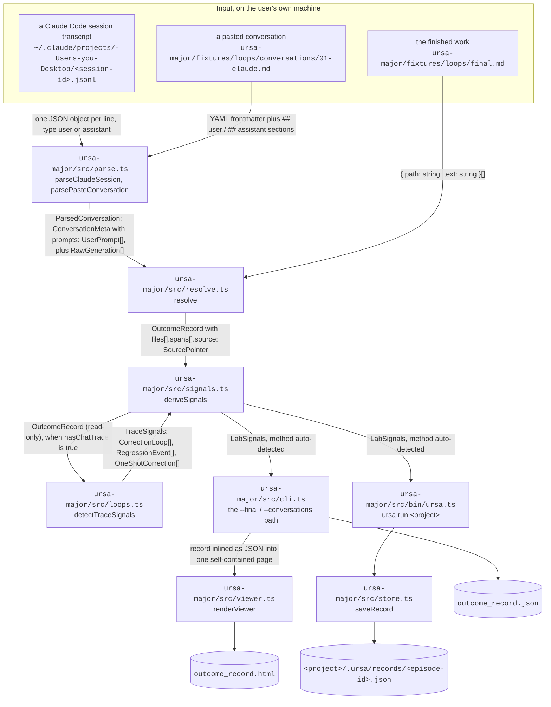

# Trace-stage correction loops and regressions

Ships sprint item 1 of `docs/sprints/sprint-2026-09-21.md`, which serves
O1 KR1.2 in `docs/okrs/2026-q4.md`. Written to the engineering-artifact
standard in `prompts/engineer-agent.md`: every node below is a file that
exists, every signature is the one a caller writes against, every command
is the literal invocation, and every term is defined where it is used.

## 0. What this is

Until this change, `ursa-major/src/signals.ts` returned
`correctionLoops: []` and `regressions: []` for every record, whatever
the input. The schema for both had been in `ursa-major/src/types.ts`
since the n=1 trial, filled by hand. This change fills them from code
for the case where the record carries a **chat trace**, meaning the
user's own messages survived into the record as
`conversations[].prompts[]`.

Two stages exist, and the difference is not cosmetic:

| Stage | Input the record was built from | What a correction looks like | Can recurrence be counted? |
|---|---|---|---|
| Label stage | a pair of git commits: one an agent commit, the next the human's edit of it (`ursa-major/src/pairfinder.ts`) | a `survived_mutated` span: agent text the user kept but rewrote. The rewrite is the correction, stated once. | No. There is one generation and one final state, so a repeat is invisible. |
| Trace stage | a Claude Code session transcript (`~/.claude/projects/<project-slug>/<session-id>.jsonl`) or a pasted conversation, parsed by `ursa-major/src/parse.ts` | a user message asking for a change. When the same ask returns, that repetition is the failure count. | Yes. That is what this document is about. |

**Term definitions used throughout, so no label below stands bare.**

- **step** — the ordinal of an assistant turn inside one conversation,
  1-based. A generation carries it as `generations[].turnIndex`. A user
  prompt carries it as `conversations[].prompts[].step`, meaning "this
  message arrived after that many assistant turns". A prompt at step 2
  is answered by generations at turnIndex 3 and later. Steps are scoped
  per conversation and never compared across two of them.
- **content term** — a word left in a prompt after structural words
  (`the`, `still`, `again`, `please`) are removed and words shorter than
  three characters are dropped. `ursa-major/src/loops.ts:contentTerms`
  produces them.
- **theme** — a set of prompts that share content terms, which is the
  detector's stand-in for "the user is asking about the same thing
  again". The theme's printed label is its three most frequent content
  terms, most frequent first, for example `constellation dark brighten`.
- **correction loop** — a theme raised two or more times. Its
  `recurrences` field is the number of restatements after the first
  ask, so a theme raised three times has two recurrences: two failures.
- **one-shot correction** — a theme raised exactly once and answered by
  a generation whose text survived into the finished work. The
  stateable baseline: the kind of preference a written rule can hold.
- **answering window** — the generations between a theme's last prompt
  and the next correction prompt in the same conversation, inclusive of
  the step that next prompt arrived at. Closure is read off this window
  and nothing outside it, so a surviving generation from unrelated later
  work cannot be credited with closing an earlier loop.
- **regression event** — a prompt that reports previously working state
  as broken (`went back to dark again`, `you broke what already
  worked`), on a theme that was already raised at an earlier step.
  Distinct from persistence (`still too dark`), which says the thing was
  never right yet and is counted as a recurrence only.

## 1. System diagram

Nodes are files or stores that exist in the repository today. Edges
carry the type or file format that actually crosses them. Rendering this
as SVG requires inventing nothing.



Inside `detectTraceSignals`, five stages run in this order, each reading
only what the one before it produced:

1. **type every prompt** — `roleOf` labels each message `task_ask` (the
   conversation's opening message, which states the spec and is not a
   failure signal), `acceptance` (a message made only of acceptance
   words, such as `Perfect, that works.`), or `correction` (everything
   else).
2. **cluster the corrections into themes** — single-linkage clustering
   on shared content terms. A prompt joins the theme whose closest
   member it matches best, requiring both `THEME_OVERLAP` (0.34 of the
   smaller term set) and `MIN_SHARED_TERMS` (2 distinct terms).
3. **attach the task ask** — if the opening message shares a theme with
   a cluster, it is prepended, so a loop that opened with the original
   ask reports that ask's step as `openedStep` rather than the first
   complaint's.
4. **read closure off survival** — inside the answering window, any
   generation with `survivedChars > 0` is a resolving step. The earliest
   is `closedStep`.
5. **emit** — themes with two or more prompts become `CorrectionLoop`;
   themes with one become `OneShotCorrection`; prompts carrying a
   regression cue on an already-raised theme also become
   `RegressionEvent`.

## 2. Interfaces at every boundary

Real signatures, copied from the modules that export them.

```ts
// ursa-major/src/loops.ts
export const THEME_OVERLAP = 0.34
export const MIN_SHARED_TERMS = 2

export type PromptRole = 'task_ask' | 'correction' | 'acceptance'

export interface TracePrompt {
  conversationId: string
  step: number
  index: number
  text: string
  role: PromptRole
  terms: string[]
  regressionCue: boolean
}

export interface TraceSignals {
  loops: CorrectionLoop[]
  regressions: RegressionEvent[]
  oneShotCorrections: OneShotCorrection[]
  steps: number
  acceptanceStatedInChat: boolean
  unresolvedSingleCorrections: number
  notes: string[]
}

export function hasChatTrace(record: OutcomeRecord): boolean
export function contentTerms(text: string): string[]
export function tracePrompts(record: OutcomeRecord): TracePrompt[]
export function detectTraceSignals(record: OutcomeRecord): TraceSignals
```

```ts
// ursa-major/src/signals.ts — unchanged signature, two-stage body
export interface Declaration {
  accepted: boolean | null
  basis: string
}
export const UNDECLARED: Declaration
export function deriveSignals(record: OutcomeRecord, declaration?: Declaration): LabSignals
```

```ts
// ursa-major/src/text.ts — new, one shared definition of a quoted excerpt
export const MAX_EXCERPT = 220
export function excerpt(text: string): string
```

```ts
// ursa-major/src/types.ts — the only schema change: one optional field on each
// of two existing interfaces, because step ordinals are per-conversation and a
// record can hold several conversations at once.
export interface CorrectionLoop {
  id: string
  conversationId?: string   // added
  theme: string
  targetFiles: string[]
  openedStep: number
  promptSteps: number[]
  recurrences: number
  regressionSteps: number[]
  closedStep: number | null
  resolution: 'accepted' | 'accepted_tacitly' | 'abandoned' | 'open'
  resolvingSteps: number[]
  discoveredSpec: string
}

export interface RegressionEvent {
  conversationId?: string   // added
  step: number
  brokenState: string
  evidence: string
  causedBySteps?: number[]
}
```

## 3. On-disk layouts

Paths that exist after this change:

```
ursa-major/
  src/loops.ts                       the detector
  src/loops.test.ts                  18 tests
  src/text.ts                        shared excerpt helper
  fixtures/loops/
    final.md                         the finished work, 6 lines of prose
    conversations/01-claude.md       one synthetic conversation, 6 user turns
```

Output paths are unchanged: `ursa run` writes
`<project>/.ursa/records/<episode-id>.json` through
`ursa-major/src/store.ts`, and `src/cli.ts --out <dir>` writes
`<dir>/outcome_record.json` plus `<dir>/outcome_record.html`.

**Real example payload.** This is the verbatim `signals` object from
running the command in section 4 against `fixtures/loops`, elided only
where marked, not a sketch. The fixture is synthetic by construction, so
no real conversation, home directory, or session identifier appears in
it; under the redaction rider a real trial record's payload stays in
`alexandrapaiz/ursa-private` and is cited by name instead of inlined.

```json
{
  "method": "auto-detected",
  "annotatedAt": "2026-09-24T16:02:05.323Z",
  "episode": {
    "steps": 6,
    "generations": 6,
    "accepted": null,
    "acceptanceStatedInChat": false,
    "acceptanceBasis": "undeclared: no owner declaration surface was offered; retention is NOT acceptance"
  },
  "correctionLoops": [
    {
      "id": "01-claude:L1",
      "conversationId": "01-claude",
      "theme": "constellation dark brighten",
      "targetFiles": ["final.md"],
      "openedStep": 1,
      "promptSteps": [1, 2, 3],
      "recurrences": 2,
      "regressionSteps": [3],
      "closedStep": 4,
      "resolution": "accepted",
      "resolvingSteps": [4],
      "discoveredSpec": "quoted from step 2, the loop's last statement of what was wanted (regression reports excluded): \"The constellation is still too dark. Brighten it more, the stars vanish above the fold.\" — the loop's other statements stand unmerged at conversations[].prompts[].step 1, 3"
    }
  ],
  "feedbackTranslations": [],
  "repairAttempts": [],
  "regressions": [
    {
      "conversationId": "01-claude",
      "step": 3,
      "brokenState": "theme \"constellation dark brighten\" was already raised at step 2 and is reported broken again here",
      "evidence": "The constellation brightness went back to dark again, you broke what already worked.",
      "causedBySteps": [3]
    }
  ],
  "defensiveGuardrails": [],
  "oneShotCorrections": [
    {
      "step": 5,
      "text": "Remove the extra padding under the footer.",
      "domain": "final.md"
    }
  ],
  "notes": ["trace-stage record: loops, regressions and one-shot corrections are auto-detected from conversations[].prompts[];", "… two further notes, see the file"]
}
```

Every number in it is auditable against the same file's raw sections:
step 4's generation is `generations[3]`, whose `survivedChars` is 115 of
115, and the span it produced is `files[0].spans[3]` with class
`survived_verbatim`.

## 4. Exact commands

Run from `ursa-major/`.

```bash
# install exactly what package-lock.json pins
npm ci

# the full suite: 44 tests, 4 files
npx vitest run

# only the new detector's tests
npx vitest run src/loops.test.ts

# type-check without emitting
npx tsc --noEmit

# resolve the public fixture end to end, writing the record and the viewer
npm run resolve -- \
  --id fixture-loops \
  --final fixtures/loops/final.md \
  --conversations fixtures/loops/conversations \
  --out /tmp/loops-out

# the same detector on a real project's git history, label stage
npx tsx src/bin/ursa.ts run <projectPath> --declare unsatisfied

# a real Claude Code session, trace stage. --path-filter keeps only the
# generations aimed at the project under study.
npx tsx src/cli.ts \
  --id ursa-minor-site \
  --final ~/Desktop/ursa-minor-site/app \
  --sessions ~/.claude/projects/-Users-you-Desktop/<session-id>.jsonl \
  --path-filter ursa-minor \
  --out trial/task-002
```

The fixture command prints this line, which is the detector reporting
itself:

```
signals: 1 loops, 1 regressions, 1 one-shot corrections, 0 translations (auto-detected)
```

## 5. Tooling

Every tool this change uses, with the version it is pinned to, its job
here, and what it was chosen over. **No new dependency was added**; the
detector is 428 lines of TypeScript in `ursa-major/src/loops.ts` plus a
12-line `ursa-major/src/text.ts`, over what the repository already had.

| Tool | Version | Job in this change | Chosen over |
|---|---|---|---|
| Node.js | 22 (active LTS; 22.23.2 on the runner that produced the output above) | runtime for the detector, the CLI and the tests | the sandbox's incidental newer build; `package.json` already targets `@types/node` ^22.10.0, so the LTS line is what the types describe |
| TypeScript | ^5.7.2 (pinned in `package.json`) | type-checks the two new modules and the two new optional schema fields with `npx tsc --noEmit` | no compile step at all: the optional-field addition is exactly the kind of change a type checker catches for free, and it did, twice, while this was written |
| tsx | ^4.19.2 (pinned) | runs `src/cli.ts` directly for the fixture run | a build step; the repository's existing pattern is `npx tsx`, and v0 is invoked, never deployed |
| vitest | ^2.1.8 (pinned) | the 18 new tests, alongside the 26 that already existed | node:test, which would mean two runners in one package for no gain |
| diff | ^8.0.2 (pinned) | already used by `resolve.ts` for `survived_mutated` diffs, which this change reads but does not alter | unchanged, listed because the detector depends on its output |
| nothing new for text handling | — | term extraction reuses `tokens()` from `src/match.ts` and `normalize()` from `src/normalize.ts` | a stemmer (`natural`, `snowball`) or embeddings: both would make a theme label unexplainable, and `src/match.ts` exists precisely because every label in this system has to be re-derivable by hand from the code and two thresholds |

## 6. Honest failure modes

Named here rather than discovered later.

- **Lexical themes miss synonyms.** `brightness` and `brighten` are two
  terms to this detector, and a user who says "too dark" once and "needs
  more contrast" the next time opens two themes rather than one loop.
  The fixture shows the failure inside a case that still works: the
  loop holds on `constellation` and `dark` alone. Consequence:
  `recurrences` is a floor, not an exact count.
- **A bridging prompt does not merge two themes.** If a prompt matches
  two existing clusters, it joins the better-scoring one and the other
  stays separate. Deterministic, and reported rather than fixed,
  because merging on a bridge is how one real loop becomes a
  session-wide blob.
- **Closure rests on survival, which is retention.** `resolution:
  'accepted_tacitly'` means text from the answering window reached the
  finished work, nothing more. It is never promoted to
  `episode.accepted`, which comes only from the owner's `--declare`.
  This is the load-bearing constraint in `CLAUDE.md`, and
  `src/loops.test.ts` pins it in two separate tests.
- **A squashed pull request destroys the chain.** Already named in
  `docs/design/product-plan.md` §8; unchanged by this work.
- **Two prompts at the same step.** Consecutive user messages with no
  assistant turn between them share a step ordinal. `TracePrompt.index`
  keeps them ordered and distinct; the loop's `promptSteps` will show
  the same number twice, which is correct rather than a bug.

## 7. What KR1.2 still needs

KR1.2's done-condition is stated against the n=1 trial: recover at least
3 of the 4 hand-annotated loops (A–D) and all 3 regression events (steps
453, 497, 732) on task-001, with no hand annotation. **That validation
cannot run in this repository.** task-001's record and its hand-made
`trajectory.md` live in `alexandrapaiz/ursa-private` after Ursa incident
2 (`docs/agents/incidents.md`), and the sprint's own notes for the
engineer forbid claiming KR1.2 done without them.

What is shippable without that access is what shipped: the detector, the
two stages, and 18 tests over synthetic data whose expected values were
derived by hand from the fixture text. The remaining step is one run of
the command in section 4 against the private record, comparing the
emitted loops to the four annotated ones. That run needs the owner's
machine or the private repository, and it is the next unit of work on
this KR.
