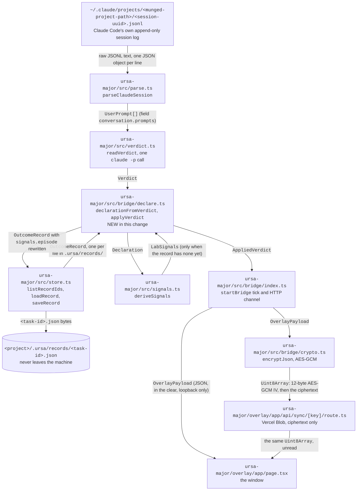

# The chat-read verdict reaches the record

Engineer run 2026-09-26. This closes the two clauses of overlay S0's
acceptance criterion (`docs/design/product-plan.md` §16.7) that the
2026-09-25 S0 commit (`356b3e5`) left unmet, and it is written to the
engineering-artifact standard in `prompts/engineer-agent.md`: real
nodes, real signatures, real paths, real payloads, exact commands,
versioned tooling, no bare terms.

## 1. Why this existed to be fixed

S0's acceptance sentence has four clauses. Read them in order:

> `ursa bridge <project>` **tails the session log**, **reads the
> verdict**, **writes records with it**, **serves `.ursa/` over the
> local socket**.

The first two shipped on 2026-09-25. The third and fourth did not. The
consequence was narrow and serious: `src/bridge/index.ts` called
`readVerdict`, put the reading in the payload it encrypted, and the
hosted page displayed `reads as satisfied at step 730` — while every
record in `<project>/.ursa/records/` still carried
`"accepted": null` and the basis string `undeclared: no owner
declaration surface was offered; retention is NOT acceptance`.

The overlay was rendering the label and dropping it. Ursa Minor's
saleable object is the outcome record with the owner's own verdict
attached (`CLAUDE.md` §1, "trajectory metadata"), so a verdict that
lives only on a screen is a verdict the product did not capture.

**What a "verdict" is here.** The user's own stated satisfaction or
dissatisfaction with the work, read out of their messages by
`src/verdict.ts`, in one tier only — `stated`. The reader returns a
`Verdict`; the record carries a `Declaration`. Those are two different
types, and nothing joined them until this change.

## 2. System diagram

Every node below is a file that exists in this repository at the
commit that introduces this document. Every edge carries a named
TypeScript type or a named file format, never a verb phrase.



Two edges are worth reading twice.

- `DEC → STORE`: this is the edge that did not exist before today. It
  is the only path by which a verdict the user stated in chat becomes
  a durable property of the outcome record.
- `CRY → SYNC`: Ursa-operated storage receives the payload only as
  ciphertext. `src/bridge/bridge.test.ts` asserts that the bytes the
  sync route received contain neither the quote nor the string
  `acceptanceBasis`.

## 3. Interfaces at every boundary

New, in `ursa-major/src/bridge/declare.ts`:

```ts
export const VERDICT_NOTE_PREFIX = 'verdict read from chat:'

export function declarationFromVerdict(verdict: Verdict): Declaration

export interface AppliedVerdict {
  /** records whose bytes changed this call; empty when the verdict was already on disk */
  changed: string[]
  /** every record the verdict now applies to, changed or already-current */
  declared: string[]
  declaration: Declaration
}

export function applyVerdict(projectPath: string, verdict: Verdict): AppliedVerdict

export const NOTHING_APPLIED: AppliedVerdict
```

New, in `ursa-major/src/store.ts`:

```ts
/** Record ids present for this project, sorted; the filename is the task id. */
export function listRecordIds(projectRoot: string): string[]

/** One record by id, or null when this project has never resolved it. */
export function loadRecord(projectRoot: string, recordId: string): OutcomeRecord | null

/** A record id must be a plain filename; anything else is refused, not joined onto a path. */
export const SAFE_RECORD_ID: RegExp   // /^[A-Za-z0-9][A-Za-z0-9._-]{0,127}$/
```

Changed, in `ursa-major/src/bridge/index.ts` — one field added to the
payload the page decrypts:

```ts
export interface OverlayPayload {
  schemaVersion: '0.1.0'
  project: string
  sessionFile: string | null
  updatedAt: string
  userTurns: number
  verdict: Verdict
  tuning: OverlayTuningLine[]
  /** ids of the records now carrying this verdict as their declaration */
  declaredRecords: string[]     // NEW
  lastRunSummary: string | null
}
```

Unchanged and depended upon, quoted here so the boundary is visible
without opening three files:

```ts
// src/verdict.ts
export interface Verdict {
  accepted: boolean | null
  step: number | null
  quote: string | null
  basis: 'read-from-chat' | 'undeclared'
  confidence: 'stated'
}

// src/signals.ts
export interface Declaration {
  accepted: boolean | null
  basis: string
}
export function deriveSignals(record: OutcomeRecord, declaration?: Declaration): LabSignals
```

The local channel, as HTTP routes on `127.0.0.1:7817`. A route is an
interface too, so each is given with its method, its path, its
response type and its failure mode:

| Method and path | Response body | Failure |
|---|---|---|
| `POST /run` | `{ summary: string }` — the text `renderRunSummary` prints | `409` with the body `a run is already in progress` when a run is in flight; `500` with the failure text when `ursa run` exits non-zero |
| `GET /payload` | `OverlayPayload` as JSON, in the clear | `503 {"error":"no tick has completed yet"}` before the first tick finishes |
| `GET /records` | `{ project: string, ids: string[] }` | never fails; an absent `.ursa/records/` directory yields `ids: []` |
| `GET /records/<task-id>` | `OutcomeRecord` as JSON | `404 {"error":"no record <id>"}`, which is also the answer for any id outside `SAFE_RECORD_ID`, so a path-traversal attempt is indistinguishable from a miss |
| `GET /health` | `{ project: string, ok: true }` | never fails while the process is up |

The listener binds `127.0.0.1` only, so nothing on the local network
can reach it. Cross-origin reads are granted to loopback origins and
to the one origin passed in `BridgeOptions.allowOrigins`, which
`src/bin/ursa.ts` sets to `https://ursa-overlay.vercel.app`.

## 4. On-disk layout, with a real payload

```
<project>/.ursa/
├── episodes.json                       # Episode[], the work-unit index
├── records/
│   └── <task-id>.json                  # one OutcomeRecord, pretty-printed, newline-terminated
└── tuning.json                         # TuningRecord, written by the distiller
```

A `<task-id>` is `<project-dir-name>-<YYYY-MM-DD>-<7-char commit sha>`,
so the filename above is `demo-proj-2026-09-26-5630fce.json`.

Here is the `signals` block of a real record, produced by the exact
commands in §5 over a throwaway two-commit repository, after
`applyVerdict` ran with the n=1 trial's own verdict. Nothing in it is
invented. Per the standard's redaction rider the project lives at
`/tmp/demo-proj` rather than the owner's home directory, and the step
number and quote are the published n=1 values, not a private session.

```json
{
  "method": "auto-detected",
  "annotatedAt": "2026-09-26T15:14:44.567Z",
  "episode": {
    "steps": 1,
    "generations": 1,
    "accepted": true,
    "acceptanceStatedInChat": true,
    "acceptanceBasis": "owner-stated satisfied, read from chat at step 730: \"yesss finallyyy!! lol\" (stated tier; the user said it, the system did not infer it)"
  },
  "correctionLoops": [],
  "feedbackTranslations": [],
  "repairAttempts": [],
  "regressions": [],
  "defensiveGuardrails": [],
  "oneShotCorrections": [
    {
      "step": 1,
      "text": "AGENT: return 'DIGEST — the latest research, summarized for you.\\n' + summary\nFINAL: return 'The frontier, read for you.\\n' + summary",
      "domain": "digest.js"
    },
    {
      "step": 1,
      "text": "AGENT: function formatItem(i) { return `- ${i.title}: ${i.claim} — why it matters: ${i.why}` }\nFINAL: function formatItem(i) { return `- ${i.title}: ${i.claim} — so what: ${i.why}` }",
      "domain": "digest.js"
    }
  ],
  "notes": [
    "label-stage record (git commit pair): corrections appear once, as edits;",
    "recurrence and loops are unobservable without the chat trace.",
    "verdict read from chat: the user stated this verdict themselves at step 730; the quote was verified verbatim against the trace, and retention played no part in it"
  ]
}
```

Before `applyVerdict`, the same three fields read:

```json
"accepted": null,
"acceptanceStatedInChat": false,
"acceptanceBasis": "undeclared: no owner declaration surface was offered; retention is NOT acceptance"
```

## 5. Exact commands

Reproduce the payload in §4 from a clean checkout:

```bash
cd ursa-major
npm install

rm -rf /tmp/demo-proj && mkdir /tmp/demo-proj && cd /tmp/demo-proj
git init -q -b main
git config user.email h@example.com
git config user.name "Human Owner"
cat > digest.js <<'EOF'
export function digest() {
  const items = fetchItems()
  const summary = items.map(formatItem).join('\n')
  return 'DIGEST — the latest research, summarized for you.\n' + summary
}
function formatItem(i) { return `- ${i.title}: ${i.claim} — why it matters: ${i.why}` }
EOF
git add . && git commit -q -m "Generate digest module

Co-Authored-By: Claude <noreply@anthropic.com>"
sed -i 's/why it matters/so what/; s/DIGEST — the latest research, summarized for you./The frontier, read for you./' digest.js
git add . && git commit -q -m "Tighten digest prose"

cd -
npx tsx src/bin/ursa.ts run /tmp/demo-proj
npx tsx -e "
import { applyVerdict } from './src/bridge/declare'
console.log(applyVerdict('/tmp/demo-proj', {
  accepted: true, step: 730, quote: 'yesss finallyyy!! lol',
  basis: 'read-from-chat', confidence: 'stated',
}).changed)
"
cat /tmp/demo-proj/.ursa/records/demo-proj-2026-09-26-5630fce.json | python3 -m json.tool
```

Run the tests this change adds, and the whole suite:

```bash
cd ursa-major
npx vitest run src/bridge/declare.test.ts src/bridge/bridge.test.ts
npx vitest run                      # 47 tests
npx tsc --noEmit -p tsconfig.json
cd overlay && npm ci && npx tsc --noEmit -p tsconfig.json
```

Drive the local channel by hand while a bridge is up:

```bash
URSA_PASSPHRASE='…' npx tsx src/bin/ursa.ts bridge /Users/<you>/Desktop/ursa-minor-site

curl -s http://127.0.0.1:7817/health
curl -s http://127.0.0.1:7817/records
curl -s http://127.0.0.1:7817/payload | python3 -m json.tool | head -30
curl -s http://127.0.0.1:7817/records/ursa-minor-site-2026-09-26-1a2b3c4 \
  | python3 -c 'import json,sys; print(json.load(sys.stdin)["signals"]["episode"])'
curl -s -o /dev/null -w '%{http_code}\n' \
  'http://127.0.0.1:7817/records/..%2F..%2F..%2Fetc%2Fpasswd'      # 404
```

## 6. Tooling

| Tool | Version | Job in this change | Why it, over the alternative considered |
|---|---|---|---|
| Node.js `node:http` `createServer` | built into Node 22.23.2 | serves the local channel on `127.0.0.1:7817` | the alternative was the `ws` WebSocket server named in plan §16.6; plain HTTP needs no dependency, and a browser on an `https://` page may call a loopback `http://` origin because loopback is exempt from mixed-content blocking. Push is not needed: the page already polls |
| Node.js `node:fs` | built into Node 22.23.2 | `readdirSync` / `readFileSync` / `writeFileSync` over `.ursa/records/` | synchronous reads of a handful of small JSON files on the owner's own disk; an async store would add a lifecycle to the tick for no measurable gain |
| Vitest | 2.1.9 installed, `^2.1.8` declared in `ursa-major/package.json` | the 11 tests this change adds | already the repository's runner; no second framework introduced |
| tsx | 4.23.8 installed, `^4.19.2` declared | runs `src/bin/ursa.ts` and one-off `-e` scripts without a build step | already the repository's runner for TypeScript entry points |
| TypeScript | 5.9.3 installed, `^5.7.2` declared | `tsc --noEmit` on the package and, separately, on `overlay/` | already the repository's compiler |
| git | 2.55.0 on the run that produced §4's payload | builds the two-commit fixture repositories the tests resolve | the tests exercise `findCommitPairs`, which reads real git history; a mocked history would test the mock |

No dependency was added to `ursa-major/package.json` or to
`ursa-major/overlay/package.json`. Steady-state cost stays $0.

## 7. The two rules this code is built to obey

1. **Silence is never acceptance** (the 2026-09-19 rule, `README.md`
   "Trials"). A `Verdict` with `accepted: null` causes `applyVerdict`
   to write nothing at all. It does not stamp a record as confirmed-
   undeclared, and it does not clear a verdict already on disk,
   because a later session in which the user said nothing evaluative
   is not a retraction of something they did say. Two tests cover
   this: `a session with no stated verdict writes nothing at all` and
   `a later silent session does not retract a verdict already on disk`.
2. **Existing annotations are not overwritten.** `deriveSignals` runs
   only when a record has no `signals` block yet. A record annotated
   by hand during the n=1 trial, or by the trace-stage detectors when
   PR #13 merges, keeps its `correctionLoops`, `regressions` and
   `notes`; only the `episode` block that holds the declaration is
   rewritten, and the one note this module owns is replaced rather
   than appended, so ticking every five seconds cannot pile up notes.
   Covered by `keeps existing annotations and rewrites only the
   episode block` and by the idempotency test.

## 8. What this does not do

- **It does not read a verdict per record.** The verdict is a
  property of the session, and the session's work is spread across
  the records that session produced, so the reading applies to all
  records in the project. A session that touches one area of a
  repository while the owner declares satisfaction with a different
  area will over-apply. Narrowing it needs the record-to-session join
  that the trace-stage path will provide, and that join is not built.
- **It does not backfill.** Records written before a verdict is read
  get the verdict on the next tick, which is right, but records in a
  project whose bridge was never run stay undeclared forever. That is
  the intended behavior, not a gap: nobody stated anything about them.
- **It does not close S1.** The page still reads its data from the
  sync route, not from `GET /payload`. The route exists and is
  tested, so wiring the page to prefer the local channel when it
  answers is a small follow-up, recorded in `docs/ideas.md`.
